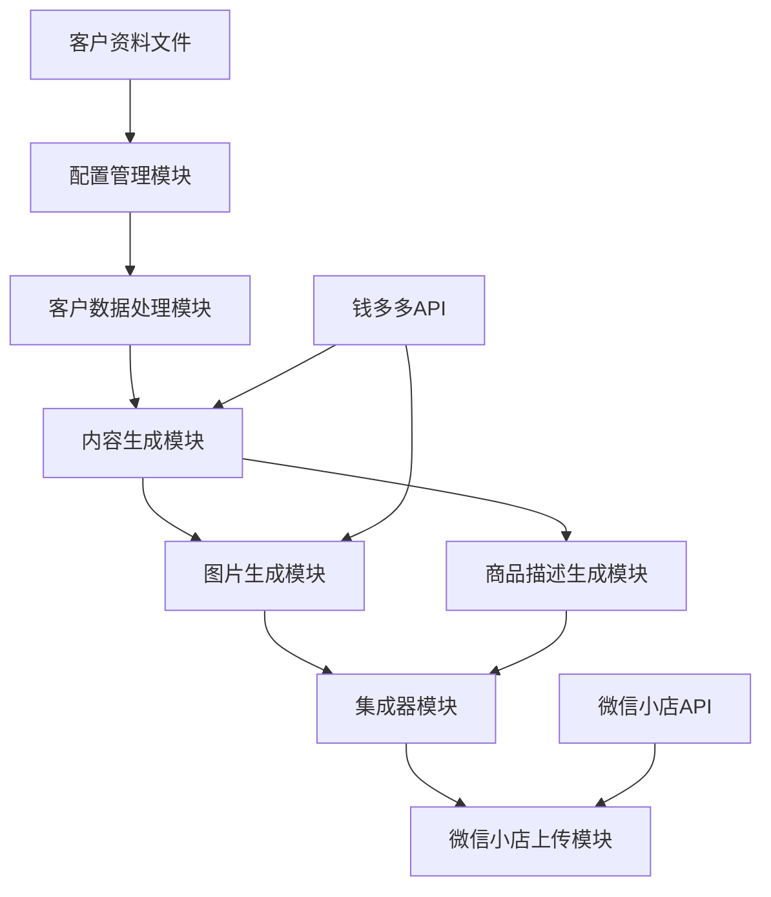

 # 教育培训商品自动生成与上传系统

## 项目简介

本系统旨在自动化处理教育培训商品的全流程管理，从读取客户提供的课程信息，使用AI模型（DeepSeek和豆包）生成高质量的商品文案、标题和图片，到最终将商品上传至微信小店平台并完成上架。

### 核心功能

- **客户资料处理**：支持JSON和Markdown格式的客户资料文件读取和解析
- **智能内容生成**：使用DeepSeek和豆包API生成吸引人的商品文案、标题
- **图片自动生成**：创建符合微信小店规范的商品主图和详情页图片
- **详情页制作**：生成结构化的商品详情页，包含课程介绍、教师信息、学习收获等
- **微信小店对接**：提供完整的商品数据准备和上传功能

## 系统架构

系统采用模块化设计，各组件职责明确，便于维护和扩展：



### 主要模块

- **配置管理模块**：统一管理系统配置，包括API密钥、模型设置等
- **客户数据处理模块**：解析和验证客户提供的课程信息
- **内容生成模块**：调用AI模型生成商品文案和标题
- **图片生成模块**：生成商品主图和详情页图片
- **商品描述生成模块**：创建符合微信小店规范的商品详情页
- **集成器模块**：协调各模块工作，实现完整业务流程
- **微信小店上传模块**：处理商品上传和上架操作

## 安装与配置

### 环境要求

- Python 3.8 或更高版本
- pip 包管理器

### 安装步骤

1. 克隆或下载项目代码

2. 安装依赖包：
   ```bash
   pip install -r requirements.txt
   ```

3. 配置环境变量

   创建 `.env` 文件，并添加以下配置：
   ```dotenv
   # 钱多多API配置
   QDD_API_KEY=your_qdd_api_key
   QDD_BASE_URL=your_qdd_api_base_url
   QDD_MODEL_NAME=DeepSeek-V3.1
   
   # 微信小店配置（用于上传功能）
   WX_APP_ID=your_wechat_app_id
   WX_APP_SECRET=your_wechat_app_secret
   ```

## 使用指南

### 准备客户资料

创建一个JSON格式的客户资料文件，包含以下信息：

```json
{
  "course_name": "课程名称",
  "teacher_info": {
    "name": "老师姓名",
    "title": "老师头衔",
    "experience": "教学经验",
    "background": "教育背景"
  },
  "course_content": "课程内容详细描述",
  "target_audience": "目标人群",
  "learning_outcomes": "学习收获",
  "course_features": ["课程特色1", "课程特色2", "课程特色3"]
}
```

### 生成商品内容

使用主程序生成商品内容和图片：

```bash
python generate_educational_product.py --input_file 客户资料文件.json --output_dir 输出目录
```

### 测试系统功能

使用测试脚本来验证整个系统的功能：

```bash
python test_full_system.py --output_dir 测试输出目录
```

### 上传商品到微信小店

使用上传脚本来将生成的商品上传到微信小店：

```bash
python backup/test_upload_product_from_csv.py
```

## 目录结构

```
├── config_manager.py         # 配置管理器
├── volcano_text_generator.py # 文本生成器（使用钱多多API）
├── volcano_image_generator.py # 图片生成器（使用钱多多API）
├── product_description_generator.py # 商品描述生成器
├── image_generation_integrator.py # 集成器
├── generate_educational_product.py # 主程序
├── test_full_system.py       # 完整测试脚本
├── backup/                   # 备份和测试文件
│   ├── test_upload_product_from_csv.py # 微信小店上传测试
├── docs/                     # 文档目录
│   ├── 系统架构说明.md        # 详细架构文档
└── requirements.txt          # 依赖清单
```

## 微信小店API说明

本系统使用微信视频号小店API进行商品上传，主要功能包括：

- 获取access_token
- 商品添加和上架
- 商品信息管理

### 配置说明

```json
{
    "appid": "你的公众号AppID",
    "appsecret": "你的公众号AppSecret",
    "api_base_url": "https://api.weixin.qq.com",
    "timeout": 30
}
```

## 注意事项

1. **配置安全**：请勿将包含密钥的配置文件分享给他人
2. **API限制**：微信API和钱多多API都有调用频率限制，请合理安排批量操作
3. **图片处理**：使用API方式上传商品时，需要先生成并保存图片
4. **权限要求**：请确保公众号有足够权限操作微信小店
5. **测试建议**：在生产环境使用前，建议先进行充分测试

## 常见问题

1. **API密钥错误**：检查环境变量中API密钥是否正确设置
2. **图片生成失败**：可能是API调用限制或参数问题，请检查日志
3. **上传失败**：检查微信小店配置和商品数据格式
4. **配置文件无法保存**：请检查文件权限，确保程序有写入权限

## 技术支持

如有问题，请查看日志文件获取详细错误信息，或根据实际情况进行调试。