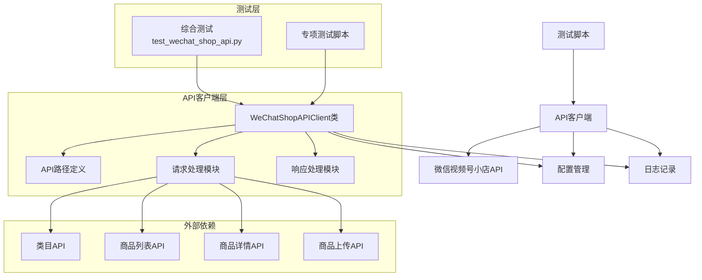
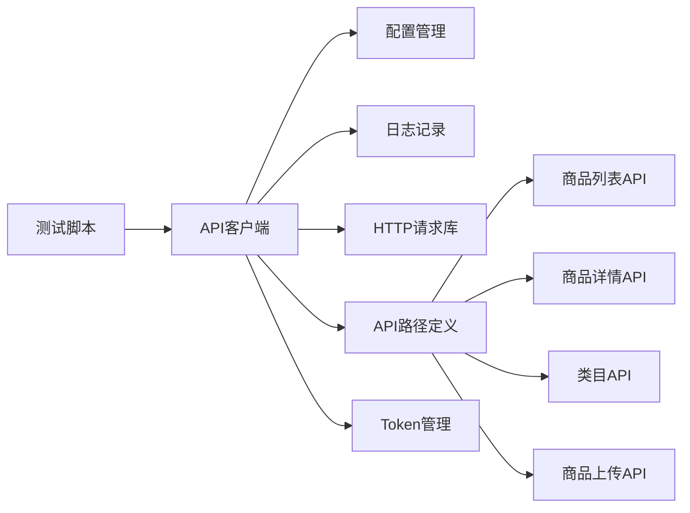
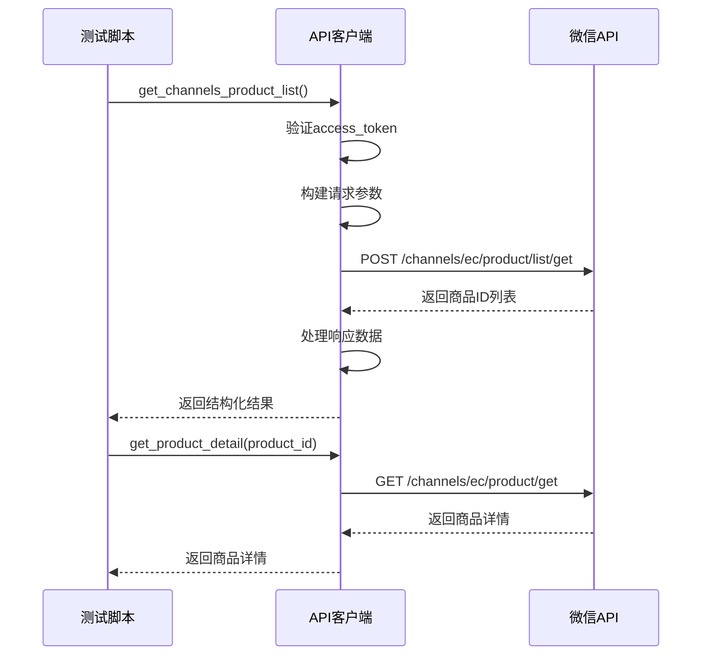

# 微信视频号小店API修复与优化设计文档

## 1. 整体架构图



## 2. 分层设计和核心组件

### 2.1 测试层

- **综合测试脚本**：`test_wechat_shop_api.py`，用于全面测试所有API功能
- **专项测试脚本**：针对特定功能的单独测试文件

### 2.2 API客户端层

- **WeChatShopAPIClient类**：核心客户端类，封装所有API调用方法
- **API路径定义**：集中管理所有API路径的常量定义
- **请求处理模块**：处理参数构建、请求发送、错误处理等
- **响应处理模块**：处理API响应数据，支持多种格式解析

### 2.3 外部依赖

- 微信视频号小店的各种API接口

## 3. 模块依赖关系图



## 4. 接口契约定义

### 4.1 核心API方法签名

#### 4.1.1 商品列表API

```python
def get_channels_product_list(self, page=1, size=10, status=None, product_id=None, next_key=None):
    """
    获取视频号小店商品列表
    
    参数:
        page: 页码
        size: 每页大小
        status: 商品状态筛选
        product_id: 商品ID，用于精确查询
        next_key: 分页游标
    
    返回:
        dict: 包含商品列表信息的字典
    """
```

#### 4.1.2 商品详情API

```python
def get_product_detail(self, product_id):
    """
    获取商品详情
    
    参数:
        product_id: 商品ID
    
    返回:
        dict: 商品详情信息
    """
```

### 4.2 数据结构定义

#### 4.2.1 商品列表请求参数

```json
{
    "page_size": 10,
    "status": 0,
    "next_key": ""
}
```

#### 4.2.2 商品列表响应结构

```json
{
    "success": true,
    "product_ids": [10000316699884, 10000302649279, ...],
    "next_key": "CN3S6b4GEKWihtGFowI=",
    "total_num": 34
}
```

## 5. 数据流向图



## 6. 异常处理策略

### 6.1 API错误码处理

- **40066 (invalid url)** - API路径错误，需要修正路径定义
- **10020052 (商品不存在)** - 商品ID无效，需要使用有效的商品ID

### 6.2 通用错误处理机制

1. **请求超时** - 实现重试机制，最多重试3次
2. **网络错误** - 记录详细错误日志，提供友好错误信息
3. **格式错误** - 验证请求参数格式，提供清晰的错误提示
4. **权限错误** - 检查access_token有效性，自动刷新过期token

### 6.3 日志记录策略

- 记录所有API调用的详细信息
- 记录请求参数、响应状态、响应时间
- 记录错误信息和错误码
- 提供操作历史记录功能