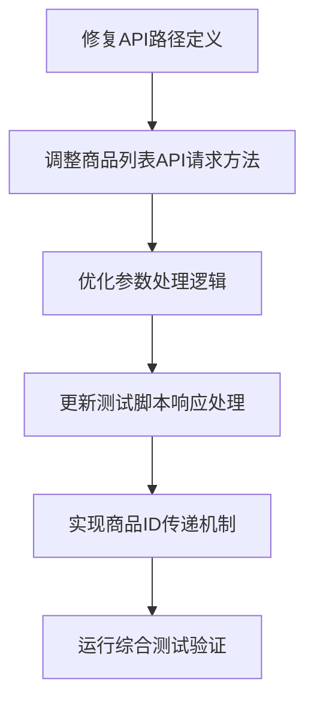

# 微信视频号小店API修复与优化任务拆分文档

## 任务依赖图

## 1. 子任务列表

### 1.1 修复API路径定义

**输入契约**：
- 现有代码中的API路径定义
- 正确的微信视频号小店API路径

**输出契约**：
- 更新后的API路径常量定义
- 确保路径格式正确无误

**实现约束**：
- 只修改API_PATHS字典中的路径值
- 保持常量命名不变
- 确保路径以斜杠开头

**依赖关系**：
- 前置任务：无
- 后置任务：调整商品列表API请求方法

### 1.2 调整商品列表API请求方法

**输入契约**：
- 修复后的API路径
- 现有get_channels_product_list方法实现

**输出契约**：
- 更新为POST方法的API调用函数
- 正确设置请求头和请求体

**实现约束**：
- 保持函数签名不变
- 确保参数传递正确
- 添加适当的注释说明

**依赖关系**：
- 前置任务：修复API路径定义
- 后置任务：优化参数处理逻辑

### 1.3 优化参数处理逻辑

**输入契约**：
- 更新后的API调用函数
- API参数要求文档

**输出契约**：
- 正确区分查询参数和请求体数据的实现
- 优化后的参数构建逻辑

**实现约束**：
- 确保参数名称与API要求一致
- 正确处理可选参数
- 实现参数验证逻辑

**依赖关系**：
- 前置任务：调整商品列表API请求方法
- 后置任务：更新测试脚本响应处理

### 1.4 更新测试脚本响应处理

**输入契约**：
- 现有测试脚本
- API响应格式规范

**输出契约**：
- 支持多种响应格式的测试逻辑
- 正确识别成功和失败响应

**实现约束**：
- 保持测试流程不变
- 增强错误处理能力
- 优化日志记录

**依赖关系**：
- 前置任务：优化参数处理逻辑
- 后置任务：实现商品ID传递机制

### 1.5 实现商品ID传递机制

**输入契约**：
- 更新后的测试脚本
- 商品列表测试结果文件

**输出契约**：
- 能够从商品列表获取真实ID的测试实现
- 确保详情测试使用有效ID

**实现约束**：
- 正确读取和解析测试结果文件
- 处理文件不存在等异常情况
- 提供合理的默认值机制

**依赖关系**：
- 前置任务：更新测试脚本响应处理
- 后置任务：运行综合测试验证

### 1.6 运行综合测试验证

**输入契约**：
- 所有修改后的代码
- 测试环境配置

**输出契约**：
- 测试执行结果
- 测试通过率报告

**实现约束**：
- 执行完整的测试套件
- 记录详细的测试日志
- 验证所有API是否正常工作

**依赖关系**：
- 前置任务：实现商品ID传递机制
- 后置任务：无

## 2. 任务验收标准

### 2.1 每个子任务的验收标准

#### 2.1.1 修复API路径定义
- API路径常量正确更新
- 路径格式符合要求

#### 2.1.2 调整商品列表API请求方法
- 函数使用POST方法发送请求
- 请求头设置正确

#### 2.1.3 优化参数处理逻辑
- 参数正确分类和处理
- 支持所有必要的参数选项

#### 2.1.4 更新测试脚本响应处理
- 测试能够识别多种响应格式
- 错误处理逻辑完善

#### 2.1.5 实现商品ID传递机制
- 测试能够从文件读取真实商品ID
- 详情测试不再使用无效ID

#### 2.1.6 运行综合测试验证
- 所有测试项目通过
- 生成完整的测试报告

### 2.2 复杂度评估

| 子任务 | 复杂度 | 预估工作量 |
|-------|-------|-----------|
| 修复API路径定义 | 低 | 0.5小时 |
| 调整商品列表API请求方法 | 低 | 1小时 |
| 优化参数处理逻辑 | 中 | 1.5小时 |
| 更新测试脚本响应处理 | 中 | 2小时 |
| 实现商品ID传递机制 | 低 | 1小时 |
| 运行综合测试验证 | 低 | 0.5小时 |

## 3. 风险评估

| 风险项 | 影响程度 | 可能性 | 缓解措施 |
|-------|---------|-------|--------|
| API路径再次变更 | 高 | 低 | 建立配置文件集中管理API路径 |
| 响应格式不统一 | 中 | 中 | 实现灵活的响应解析逻辑 |
| 测试环境无商品数据 | 高 | 低 | 提供模拟数据或错误处理机制 |
| 网络连接问题 | 中 | 低 | 实现超时和重试机制 |