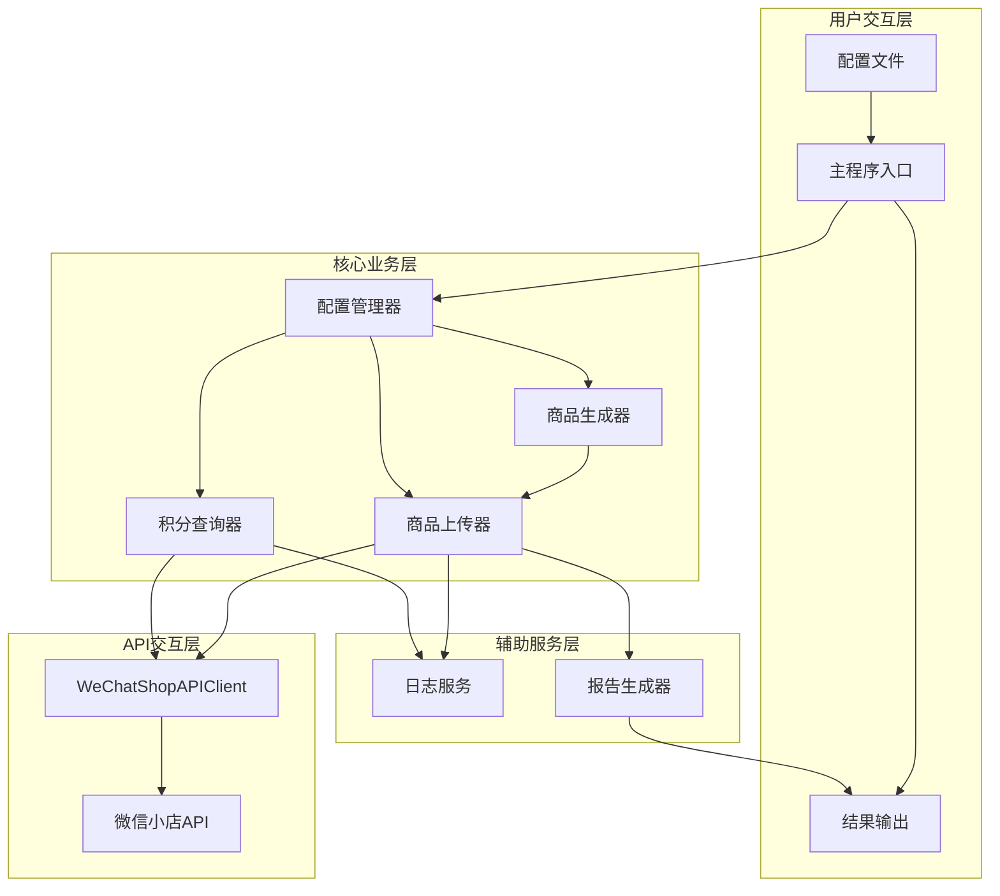
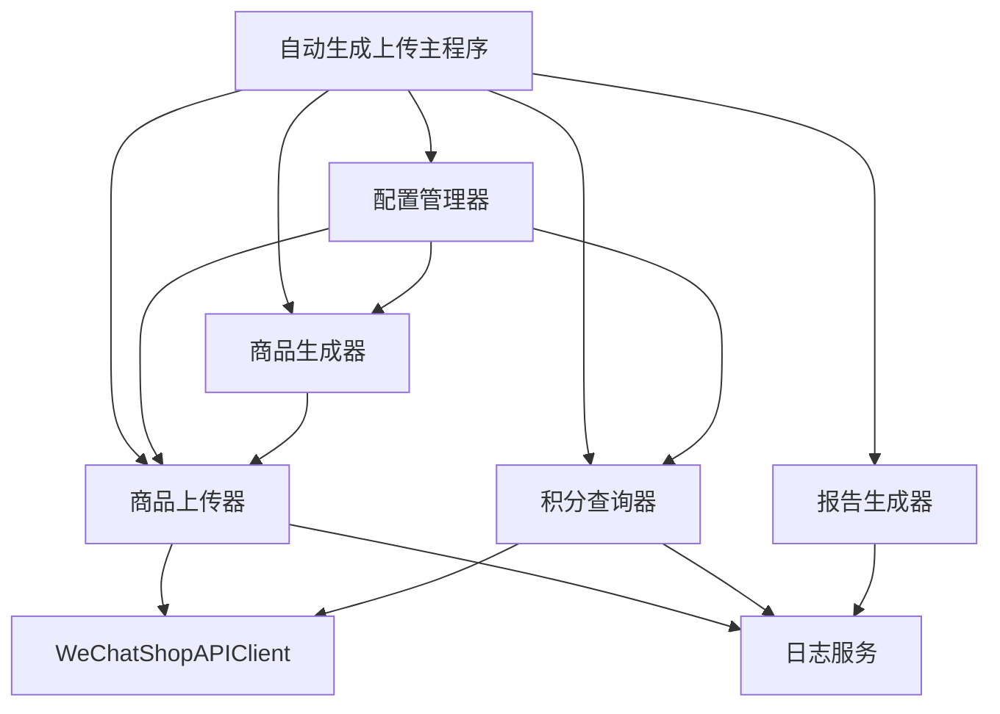
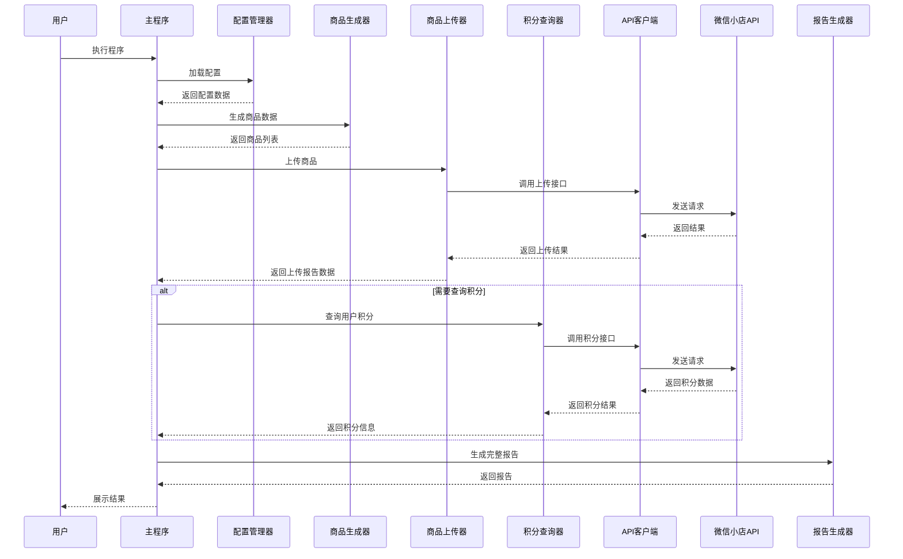

# 商品自动生成与上传功能设计文档

## 1. 整体架构图



## 2. 分层设计和核心组件

### 2.1 用户交互层
- **配置文件**：JSON格式，包含生成规则、上传参数、积分查询配置等
- **主程序入口**：提供命令行接口，解析参数，协调各模块工作
- **结果输出**：展示执行结果和生成报告

### 2.2 核心业务层
- **配置管理器**：负责读取、解析和验证配置文件
- **商品生成器**：实现商品信息的自动生成逻辑
- **商品上传器**：处理商品上传流程，包括重试机制
- **积分查询器**：实现用户积分查询功能

### 2.3 API交互层
- **WeChatShopAPIClient**：复用现有的API客户端类
- **微信小店API**：实际的微信API接口

### 2.4 辅助服务层
- **日志服务**：记录操作日志和错误信息
- **报告生成器**：生成上传报告和统计信息

## 3. 模块依赖关系图



## 4. 接口契约定义

### 4.1 配置管理器接口
```python
class ConfigManager:
    def __init__(self, config_path):
        # 初始化配置管理器
        pass
    
    def load_config(self):
        # 加载配置文件
        # 返回：配置字典
        pass
    
    def validate_config(self):
        # 验证配置有效性
        # 返回：是否有效
        pass
    
    def get_generation_config(self):
        # 获取生成配置
        # 返回：生成配置字典
        pass
    
    def get_upload_config(self):
        # 获取上传配置
        # 返回：上传配置字典
        pass
    
    def get_points_config(self):
        # 获取积分查询配置
        # 返回：积分配置字典
        pass
```

### 4.2 商品生成器接口
```python
class ProductGenerator:
    def __init__(self, config):
        # 初始化商品生成器
        pass
    
    def generate_single_product(self):
        # 生成单个商品信息
        # 返回：商品数据字典
        pass
    
    def generate_products(self, count):
        # 批量生成商品信息
        # 参数：count - 生成数量
        # 返回：商品数据列表
        pass
    
    def validate_product(self, product):
        # 验证商品数据是否符合API要求
        # 参数：product - 商品数据
        # 返回：是否有效
        pass
```

### 4.3 商品上传器接口
```python
class ProductUploader:
    def __init__(self, config, api_client):
        # 初始化商品上传器
        pass
    
    def upload_single_product(self, product_data):
        # 上传单个商品
        # 参数：product_data - 商品数据
        # 返回：上传结果
        pass
    
    def batch_upload_products(self, products):
        # 批量上传商品
        # 参数：products - 商品列表
        # 返回：上传报告
        pass
    
    def handle_upload_error(self, product, error, retry_count):
        # 处理上传错误
        # 参数：product - 商品数据, error - 错误信息, retry_count - 重试次数
        # 返回：是否需要重试
        pass
```

### 4.4 积分查询器接口
```python
class PointsQuery:
    def __init__(self, config, api_client):
        # 初始化积分查询器
        pass
    
    def query_user_points(self, openid):
        # 查询用户积分
        # 参数：openid - 用户openid
        # 返回：积分信息
        pass
    
    def batch_query_points(self, openids):
        # 批量查询用户积分
        # 参数：openids - openid列表
        # 返回：积分信息字典
        pass
```

### 4.5 报告生成器接口
```python
class ReportGenerator:
    def __init__(self):
        # 初始化报告生成器
        pass
    
    def generate_upload_report(self, upload_results):
        # 生成上传报告
        # 参数：upload_results - 上传结果列表
        # 返回：报告字典
        pass
    
    def save_report(self, report, file_path):
        # 保存报告到文件
        # 参数：report - 报告数据, file_path - 文件路径
        # 返回：是否成功
        pass
    
    def print_report_summary(self, report):
        # 打印报告摘要
        # 参数：report - 报告数据
        pass
```

## 5. 数据流向图



## 6. 异常处理策略

### 6.1 配置相关异常
- **配置文件不存在**：提示用户创建配置文件
- **配置格式错误**：提供具体的错误位置和修复建议
- **配置项缺失**：列出缺失的必要配置项

### 6.2 商品生成异常
- **生成规则错误**：记录错误并使用默认规则
- **生成数据无效**：跳过无效商品，继续生成其他商品

### 6.3 上传异常处理
- **网络异常**：实现指数退避重试机制，最多重试3次
- **API错误码处理**：
  - 429（频率限制）：暂停5-10秒后重试
  - 400（参数错误）：记录错误并跳过该商品
  - 401/403（认证错误）：重新获取access_token
  - 其他错误：根据错误码提供具体建议

### 6.4 日志记录策略
- 所有异常记录详细错误信息
- 记录API调用状态和结果
- 生成操作摘要，包含成功/失败统计

## 7. 主要流程设计

### 7.1 程序启动流程
1. 解析命令行参数
2. 加载配置文件
3. 初始化各模块
4. 验证配置有效性

### 7.2 商品生成流程
1. 根据配置选择生成模式
2. 生成商品基本信息
3. 生成SKU信息
4. 验证生成结果
5. 返回商品数据

### 7.3 批量上传流程
1. 遍历商品列表
2. 逐个上传商品
3. 处理上传结果
4. 实现限流和重试
5. 生成上传报告

### 7.4 积分查询流程
1. 验证openid有效性
2. 调用积分查询接口
3. 处理查询结果
4. 格式化返回数据

## 8. 扩展性设计

### 8.1 生成规则扩展
- 提供插件式生成器接口，支持自定义生成逻辑
- 支持从不同数据源获取生成模板

### 8.2 API功能扩展
- 设计灵活的接口适配器，便于支持新的API版本
- 支持扩展新的操作类型