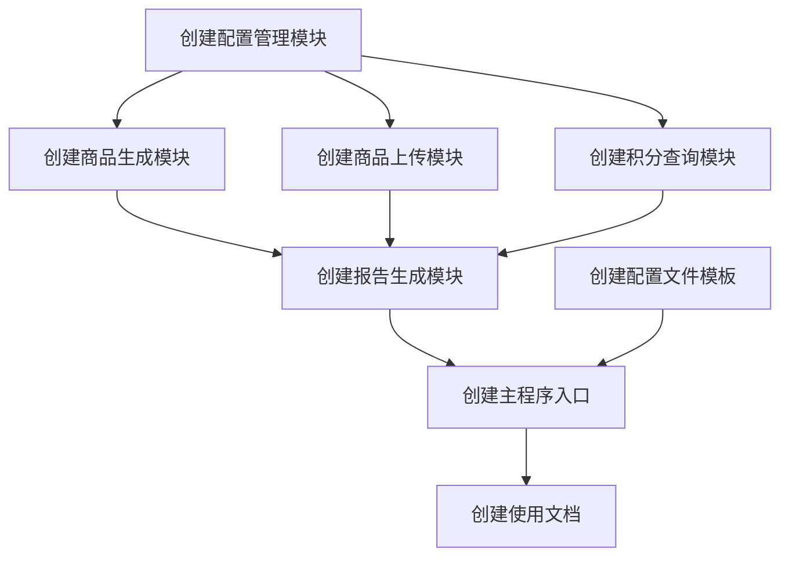

# 商品自动生成与上传功能任务拆分文档

## 1. 任务依赖图

## 2. 原子任务定义

### 2.1 T1: 创建配置管理模块

**输入契约**:
- 配置文件路径（JSON格式）

**输出契约**:
- `config_manager.py` 文件，包含ConfigManager类
- 配置验证和解析功能

**实现约束**:
- 支持读取和验证JSON配置文件
- 提供获取不同类型配置的方法
- 错误处理完善，提供清晰的错误信息

**依赖关系**:
- 无前置依赖
- 后置依赖：T3, T4, T5

### 2.2 T2: 创建配置文件模板

**输入契约**:
- 无

**输出契约**:
- `product_generator_config.json` 配置文件模板
- 包含生成规则、上传参数、积分查询配置等

**实现约束**:
- 提供详细的配置项说明
- 包含合理的默认值
- 遵循JSON格式规范

**依赖关系**:
- 无前置依赖
- 后置依赖：T7

### 2.3 T3: 创建商品生成模块

**输入契约**:
- 生成配置（从ConfigManager获取）

**输出契约**:
- `product_generator.py` 文件，包含ProductGenerator类
- 支持单商品和批量商品生成

**实现约束**:
- 生成符合微信小店API要求的商品数据
- 支持配置化的生成规则
- 实现商品数据验证

**依赖关系**:
- 前置依赖：T1
- 后置依赖：T6

### 2.4 T4: 创建商品上传模块

**输入契约**:
- 上传配置（从ConfigManager获取）
- WeChatShopAPIClient实例
- 商品数据（从ProductGenerator获取）

**输出契约**:
- `product_uploader.py` 文件，包含ProductUploader类
- 支持单商品和批量商品上传
- 实现错误处理和重试机制

**实现约束**:
- 调用现有WeChatShopAPIClient的相关方法
- 实现限流和重试逻辑
- 详细记录上传过程和结果

**依赖关系**:
- 前置依赖：T1
- 后置依赖：T6

### 2.5 T5: 创建积分查询模块

**输入契约**:
- 积分查询配置（从ConfigManager获取）
- WeChatShopAPIClient实例
- 用户openid

**输出契约**:
- `points_query.py` 文件，包含PointsQuery类
- 支持单用户和批量用户积分查询

**实现约束**:
- 实现getvipuserscore接口调用
- 处理查询结果和异常
- 格式化返回积分数据

**依赖关系**:
- 前置依赖：T1
- 后置依赖：T6

### 2.6 T6: 创建报告生成模块

**输入契约**:
- 上传结果数据（从ProductUploader获取）
- 积分查询结果（从PointsQuery获取）

**输出契约**:
- `report_generator.py` 文件，包含ReportGenerator类
- 生成详细的操作报告

**实现约束**:
- 支持保存报告到文件
- 提供报告摘要打印功能
- 统计成功率、失败率等指标

**依赖关系**:
- 前置依赖：T3, T4, T5
- 后置依赖：T7

### 2.7 T7: 创建主程序入口

**输入契约**:
- 命令行参数
- 配置文件路径

**输出契约**:
- `auto_product_generator.py` 主程序文件
- 提供命令行接口

**实现约束**:
- 解析命令行参数
- 协调各模块工作
- 提供帮助信息和使用指南

**依赖关系**:
- 前置依赖：T1, T2, T6
- 后置依赖：T8

### 2.8 T8: 创建使用文档

**输入契约**:
- 无

**输出契约**:
- `自动生成上传使用说明.md` 文档
- 包含配置说明、使用方法、示例等

**实现约束**:
- 文档清晰易懂
- 提供配置项详细说明
- 包含常见问题解答

**依赖关系**:
- 前置依赖：T7

## 3. 任务执行顺序

1. T1: 创建配置管理模块
2. T2: 创建配置文件模板
3. T3: 创建商品生成模块
4. T4: 创建商品上传模块
5. T5: 创建积分查询模块
6. T6: 创建报告生成模块
7. T7: 创建主程序入口
8. T8: 创建使用文档

## 4. 验收标准

### 4.1 配置管理模块
- 能正确加载和解析配置文件
- 能验证配置有效性并提供错误提示
- 能返回正确的配置数据

### 4.2 商品生成模块
- 能根据配置生成符合API要求的商品数据
- 批量生成功能正常工作
- 商品数据验证功能有效

### 4.3 商品上传模块
- 能成功上传单个和批量商品
- 错误处理和重试机制正常工作
- 上传过程有详细日志

### 4.4 积分查询模块
- 能正确查询用户积分
- 异常处理机制有效
- 返回格式化的积分数据

### 4.5 报告生成模块
- 能生成包含所有关键信息的报告
- 报告格式清晰易读
- 统计数据准确

### 4.6 主程序
- 命令行参数解析正确
- 各模块集成正常
- 程序流程完整

### 4.7 使用文档
- 文档内容完整
- 说明清晰易懂
- 包含必要的示例