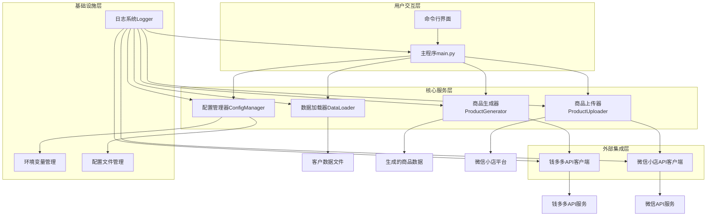
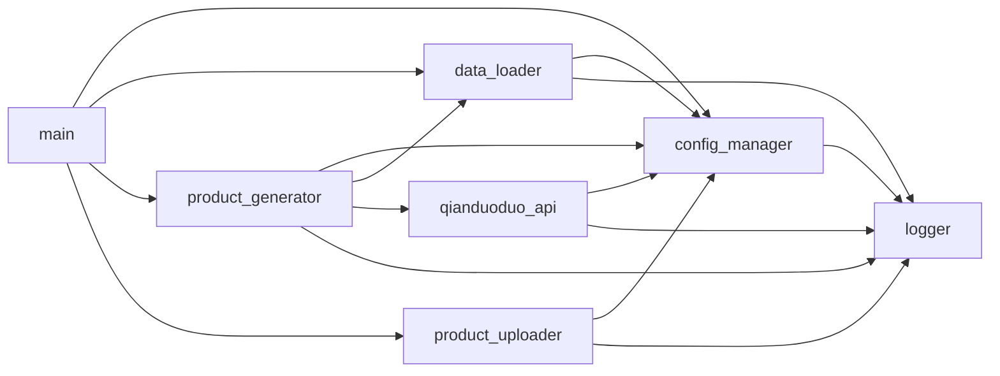
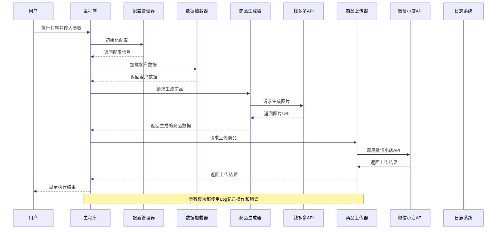

# 商品自动生成上传系统优化 - 设计文档

## 1. 整体架构图



## 2. 分层设计和核心组件

### 2.1 用户交互层

- **主程序 (main.py)**：系统入口点，负责协调整个工作流程，处理命令行参数，调用各模块完成商品生成和上传任务

### 2.2 核心服务层

- **配置管理器 (ConfigManager)**：统一管理系统配置，支持多源配置（环境变量、配置文件、命令行参数）和优先级处理
- **数据加载器 (DataLoader)**：负责加载和验证客户数据，支持多种格式（JSON、文本）
- **商品生成器 (ProductGenerator)**：基于客户数据生成商品信息，包括标题、描述、价格等
- **商品上传器 (ProductUploader)**：负责将商品信息上传到微信小店

### 2.3 外部集成层

- **钱多多API客户端**：封装与钱多多API的交互，处理文本和图片生成
- **微信小店API客户端**：封装与微信小店API的交互，处理商品上传

### 2.4 基础设施层

- **环境变量管理**：处理.env文件和系统环境变量
- **配置文件管理**：处理JSON格式的配置文件
- **日志系统 (Logger)**：提供统一的日志记录功能

## 3. 模块依赖关系图



## 4. 接口契约定义

### 4.1 配置管理器 (ConfigManager)

```python
class ConfigManager:
    def __init__(self, config_path: Optional[str] = None):
        """初始化配置管理器"""
        
    def get_config(self, key: str, default: Any = None) -> Any:
        """获取配置值"""
        
    def get_api_config(self) -> Dict[str, str]:
        """获取API相关配置"""
        
    def get_generation_config(self) -> Dict[str, Any]:
        """获取生成相关配置"""
        
    def get_upload_config(self) -> Dict[str, Any]:
        """获取上传相关配置"""
        
    def get_qianduoduo_api_config(self) -> Dict[str, Any]:
        """获取钱多多API配置"""
```

### 4.2 数据加载器 (DataLoader)

```python
class DataLoader:
    def __init__(self):
        """初始化数据加载器"""
        
    def load_json_data(self, file_path: str) -> Dict[str, Any]:
        """加载JSON格式的数据"""
        
    def load_text_data(self, file_path: str) -> Dict[str, Any]:
        """加载文本格式的数据"""
        
    def validate_client_data(self, client_data: Dict[str, Any]) -> bool:
        """验证客户数据的有效性"""
        
    def load_openid_list(self, file_path: str) -> List[str]:
        """加载openid列表"""
        
    def load_product_data(self, file_path: str) -> List[Dict[str, Any]]:
        """加载商品数据"""
        
    def save_data(self, data: Any, file_path: str) -> bool:
        """保存数据到文件"""
```

### 4.3 商品生成器 (ProductGenerator)

```python
class ProductGenerator:
    def __init__(self, config_manager: Optional[ConfigManager] = None):
        """初始化商品生成器"""
        
    def generate_product(self, client_data: Dict[str, Any]) -> Dict[str, Any]:
        """生成单个商品"""
        
    def generate_batch(self, client_data: Dict[str, Any], count: int = 1) -> List[Dict[str, Any]]:
        """批量生成商品"""
        
    async def generate_batch_async(self, client_data: Dict[str, Any], count: int = 1) -> List[Dict[str, Any]]:
        """异步批量生成商品"""
        
    def save_products(self, products: List[Dict[str, Any]], file_path: str) -> bool:
        """保存商品数据到文件"""
```

### 4.4 商品上传器 (ProductUploader)

```python
class ProductUploader:
    def __init__(self, config_manager: Optional[ConfigManager] = None):
        """初始化商品上传器"""
        
    def test_connection(self) -> bool:
        """测试与微信小店API的连接"""
        
    def upload_product(self, product: Dict[str, Any]) -> Dict[str, Any]:
        """上传单个商品"""
        
    def upload_products(self, products: List[Dict[str, Any]]) -> List[Dict[str, Any]]:
        """批量上传商品"""
        
    async def upload_products_async(self, products: List[Dict[str, Any]]) -> List[Dict[str, Any]]:
        """异步批量上传商品"""
        
    def save_upload_results(self, results: List[Dict[str, Any]], file_path: str) -> bool:
        """保存上传结果"""
        
    def generate_upload_report(self, results: List[Dict[str, Any]]) -> str:
        """生成上传报告"""
        
    def close(self) -> None:
        """关闭连接"""
```

### 4.5 钱多多API客户端 (QianduoDuoAPI)

```python
class QianduoDuoAPI:
    def __init__(self, config_manager: Optional[ConfigManager] = None):
        """初始化钱多多API客户端"""
        
    def generate_image(self, prompt: str) -> str:
        """生成单个图片"""
        
    def generate_images_batch(self, prompts: List[str]) -> List[str]:
        """批量生成图片"""
        
    def check_api_status(self) -> bool:
        """检查API状态"""
```

### 4.6 日志系统 (Logger)

```python
class Logger:
    @staticmethod
    def get_instance() -> 'Logger':
        """获取日志器实例"""
        
    def log(self, message: str, level: str = 'INFO') -> None:
        """记录日志"""
        
    def debug(self, message: str) -> None:
        """记录调试日志"""
        
    def info(self, message: str) -> None:
        """记录信息日志"""
        
    def warning(self, message: str) -> None:
        """记录警告日志"""
        
    def error(self, message: str) -> None:
        """记录错误日志"""
        
    def critical(self, message: str) -> None:
        """记录严重错误日志"""
```

## 5. 数据流向图



## 6. 异常处理策略

### 6.1 异常分类

- **配置异常**：配置文件不存在、配置值无效等
- **数据异常**：数据格式错误、数据缺失等
- **API异常**：API调用失败、响应格式错误等
- **网络异常**：连接超时、网络中断等
- **系统异常**：磁盘空间不足、权限错误等

### 6.2 异常处理机制

1. **配置异常**：
   - 使用默认配置作为备选
   - 记录详细错误信息
   - 提供清晰的错误提示

2. **数据异常**：
   - 验证输入数据格式
   - 提供详细的数据错误位置和原因
   - 支持数据自动修复（如字段类型转换）

3. **API异常**：
   - 实现指数退避重试机制
   - 设置合理的超时时间
   - 记录API调用详情（请求参数、响应内容）
   - 提供友好的错误信息

4. **网络异常**：
   - 实现自动重连机制
   - 监控网络状态
   - 提供网络诊断功能

5. **系统异常**：
   - 捕获并记录所有未预期的异常
   - 提供应急处理方案
   - 确保系统优雅退出

### 6.3 重试策略

对于可重试的操作（如网络请求），采用以下重试策略：

- 初始重试间隔：1秒
- 最大重试次数：3次
- 指数退避因子：2
- 最大重试间隔：10秒

## 7. 设计原则

- **单一职责原则**：每个模块只负责一项功能
- **依赖注入原则**：通过依赖注入管理模块间依赖关系
- **接口隔离原则**：模块接口简洁明确，避免不必要的依赖
- **可测试性原则**：设计支持单元测试和集成测试
- **可扩展性原则**：系统架构支持功能扩展和模块替换
- **错误优先原则**：优先处理可能的错误情况
- **日志优先原则**：关键操作必须有日志记录

## 8. 总结

本设计文档详细定义了商品自动生成上传系统的架构、模块接口、数据流向和异常处理策略。通过清晰的分层设计和接口定义，确保了系统的可维护性和可扩展性。系统采用依赖注入和单一职责原则，使各模块之间松耦合，便于单独测试和优化。异常处理策略全面覆盖了各种可能的错误情况，确保系统的稳定性和可靠性。