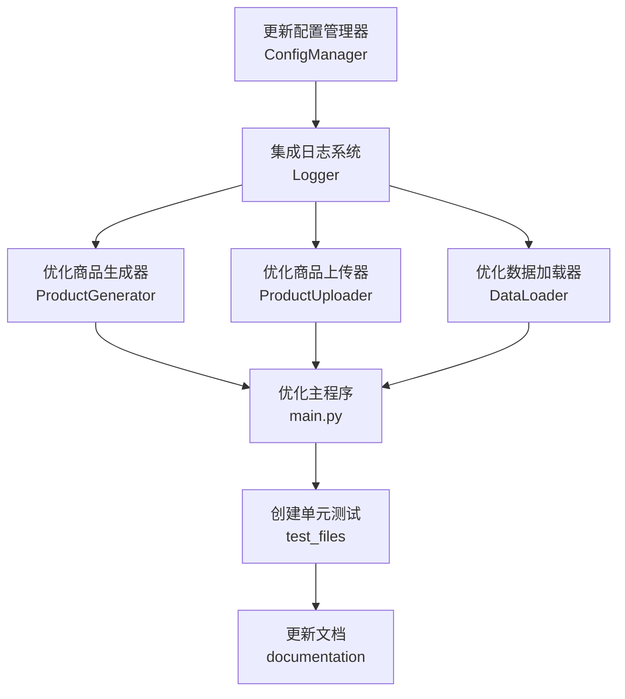

# 商品自动生成上传系统优化 - 任务拆分文档

## 1. 任务依赖图

## 2. 任务清单

### 任务1: 更新配置管理器 (ConfigManager)

#### 输入契约
- 现有 config_manager.py 文件
- 配置优先级需求说明
- 环境变量和配置文件支持需求

#### 输出契约
- 更新后的 config_manager.py 文件，支持：
  - 多源配置（环境变量、配置文件、默认值）
  - 配置优先级处理
  - 集成日志系统
  - 配置验证功能

#### 实现约束
- 保持向后兼容性
- 遵循现有代码风格
- 支持类型注解
- 完善的错误处理

#### 验收标准
- 配置管理器能正确加载不同来源的配置
- 配置优先级正确应用
- 能正确集成日志系统记录配置加载过程
- 配置验证功能正常工作

### 任务2: 集成日志系统 (Logger)

#### 输入契约
- 已创建的 utils/logger.py 文件
- 各模块需要日志记录的功能点

#### 输出契约
- 确保所有核心模块集成日志系统：
  - ConfigManager
  - DataLoader
  - ProductGenerator
  - ProductUploader
  - 主程序

#### 实现约束
- 使用 Logger 单例
- 记录关键操作、错误和警告
- 确保日志格式一致性

#### 验收标准
- 所有模块能正确记录日志
- 日志级别控制正常
- 日志输出格式统一规范
- 包含足够的上下文信息

### 任务3: 优化商品生成器 (ProductGenerator)

#### 输入契约
- 现有 product_generator.py 文件
- ConfigManager 实例
- Logger 实例

#### 输出契约
- 更新后的 product_generator.py 文件，支持：
  - 从 ConfigManager 获取配置
  - 集成 Logger 记录生成过程
  - 优化商品数据验证
  - 支持异步生成

#### 实现约束
- 保持与现有 API 的兼容性
- 异常处理机制优化
- 资源使用效率提升

#### 验收标准
- 能正确从配置管理器获取配置
- 生成过程日志记录完整
- 商品数据验证功能正常
- 异步生成功能正常工作

### 任务4: 优化商品上传器 (ProductUploader)

#### 输入契约
- 已更新的 product_uploader.py 文件
- ConfigManager 实例
- Logger 实例
- 微信小店 API 要求

#### 输出契约
- 最终的 product_uploader.py 文件，确保：
  - 配置管理器集成完善
  - 日志系统集成完善
  - 连接测试功能正常
  - 上传结果处理优化
  - 会话管理优化

#### 实现约束
- 确保与微信小店 API 兼容性
- 重试机制优化
- 错误处理完善

#### 验收标准
- 配置加载和应用正常
- 日志记录完整准确
- 连接测试功能有效
- 上传结果能正确处理和保存
- 会话管理不出现资源泄漏

### 任务5: 优化数据加载器 (DataLoader)

#### 输入契约
- 现有 data_loader.py 文件
- ConfigManager 实例
- Logger 实例

#### 输出契约
- 更新后的 data_loader.py 文件，支持：
  - 从 ConfigManager 获取配置
  - 集成 Logger 记录加载过程
  - 数据验证功能增强
  - 支持多种数据格式

#### 实现约束
- 保持现有数据格式兼容性
- 性能优化
- 错误处理完善

#### 验收标准
- 配置加载和应用正常
- 加载过程日志记录完整
- 数据验证功能有效
- 支持指定的数据格式加载

### 任务6: 优化主程序 (main.py)

#### 输入契约
- 已创建的 main.py 文件
- 各模块优化后的实现
- 命令行参数需求

#### 输出契约
- 更新后的 main.py 文件，包含：
  - 统一的模块初始化和配置
  - 增强的命令行参数处理
  - 集成日志系统
  - 错误处理机制优化
  - 异步流程支持

#### 实现约束
- 保持现有命令行接口兼容性
- 流程控制优化
- 用户交互友好性

#### 验收标准
- 能正确初始化和配置所有模块
- 命令行参数处理正常
- 日志记录完整
- 错误处理机制有效
- 异步流程正常工作

### 任务7: 创建单元测试 (test_files)

#### 输入契约
- 优化后的各模块实现
- 测试框架（unittest/pytest）

#### 输出契约
- 各模块对应的测试文件：
  - test_config_manager.py
  - test_data_loader.py
  - test_product_generator.py
  - test_product_uploader.py
  - test_main.py

#### 实现约束
- 测试覆盖正常流程、边界条件和异常情况
- 测试代码清晰可读
- 支持测试隔离

#### 验收标准
- 测试覆盖率达到 80% 以上
- 所有测试用例通过
- 测试能正确模拟依赖

### 任务8: 更新文档 (documentation)

#### 输入契约
- 现有文档文件
- 系统实现变更

#### 输出契约
- 更新的文档文件：
  - README.md
  - 系统架构说明.md
  - 使用指南和示例

#### 实现约束
- 文档内容与代码实现一致
- 文档结构清晰
- 包含足够的使用示例

#### 验收标准
- 文档内容完整准确
- 反映系统最新实现
- 包含配置说明和使用示例
- 文档格式规范统一

## 3. 任务复杂度评估

| 任务 | 复杂度 (1-10) | 预估工作量 | 依赖任务 |
|------|--------------|-----------|----------|
| 任务1: 更新配置管理器 | 7 | 中 | 无 |
| 任务2: 集成日志系统 | 6 | 中 | 任务1 |
| 任务3: 优化商品生成器 | 8 | 高 | 任务1, 任务2 |
| 任务4: 优化商品上传器 | 9 | 高 | 任务1, 任务2 |
| 任务5: 优化数据加载器 | 7 | 中 | 任务1, 任务2 |
| 任务6: 优化主程序 | 8 | 高 | 任务3, 任务4, 任务5 |
| 任务7: 创建单元测试 | 6 | 中 | 任务6 |
| 任务8: 更新文档 | 5 | 低 | 任务6 |

## 4. 关键任务说明

### 任务1: 更新配置管理器

这是一个基础任务，为其他所有模块提供配置支持。需要确保配置管理器能够处理多源配置，并正确应用优先级规则。配置管理器需要集成日志系统，记录配置加载和应用过程，便于问题排查。

### 任务4: 优化商品上传器

这是一个关键任务，直接关系到系统的核心功能。商品上传器需要确保与微信小店 API 的兼容性，实现可靠的重试机制和会话管理，同时优化上传结果的处理和保存。

### 任务6: 优化主程序

主程序是系统的入口点，需要协调整个工作流程。优化主程序需要确保模块间的正确协作，处理各种边界条件和异常情况，提供友好的用户交互体验。

## 5. 风险和注意事项

- **API 兼容性风险**：微信小店 API 和钱多多 API 可能会有更新，需要定期检查和适配
- **配置管理风险**：多源配置和优先级处理可能导致配置冲突
- **性能风险**：大量商品生成和上传可能导致性能问题，需要优化异步处理
- **错误处理风险**：异常情况处理不当可能导致系统不稳定
- **测试覆盖风险**：测试用例覆盖不全面可能导致隐藏问题

## 6. 任务执行顺序建议

1. 首先执行任务1，更新配置管理器
2. 然后执行任务2，集成日志系统
3. 并行执行任务3、任务4、任务5，优化各核心模块
4. 接着执行任务6，优化主程序
5. 然后执行任务7，创建单元测试
6. 最后执行任务8，更新文档

这种执行顺序确保了基础模块先行，然后再优化依赖它们的功能模块，最后进行测试和文档更新，符合软件开发的最佳实践。