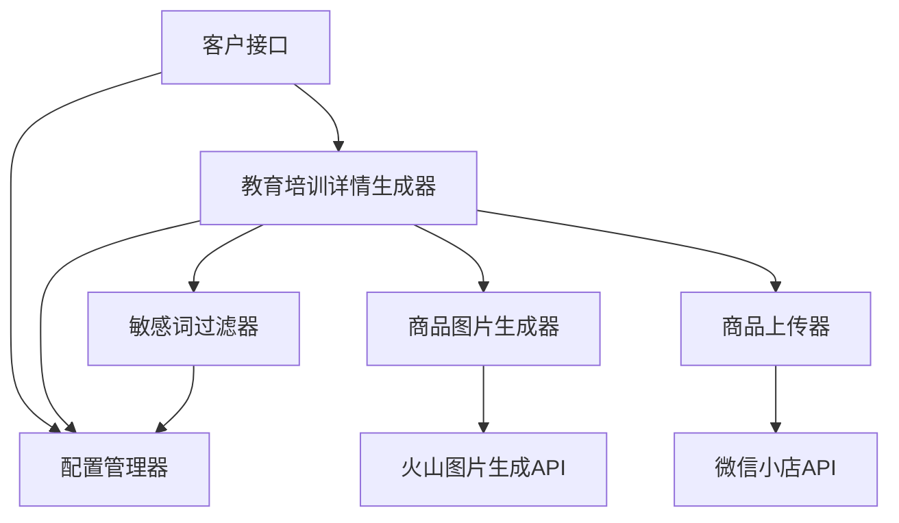
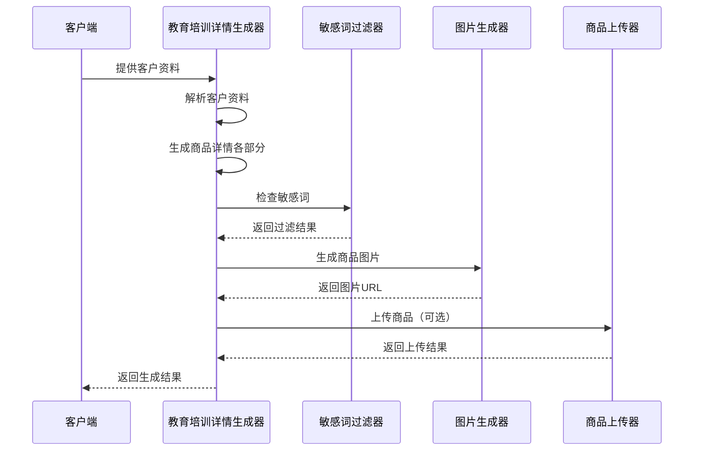
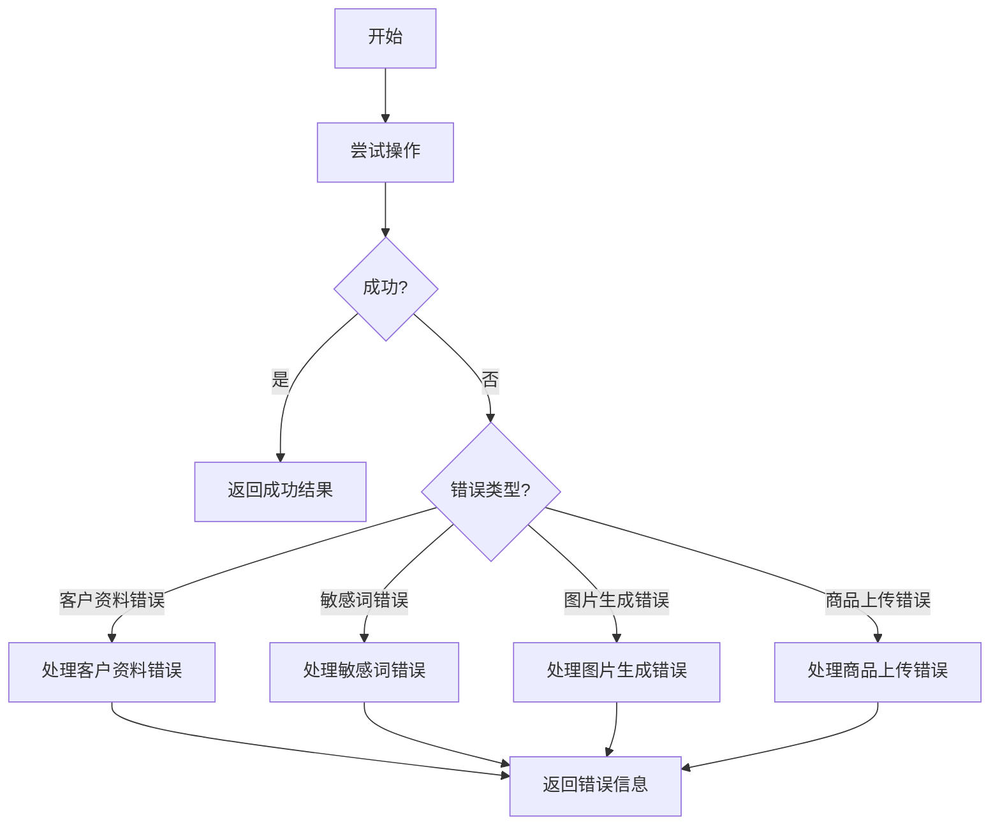

# 教育培训商品详情生成 - 设计文档

## 1. 整体架构设计

### 1.1 架构概述

根据共识文档，我们需要设计一个教育培训商品详情生成系统，该系统将与现有的商品生成和上传系统集成，提供符合微信小店教育培训类目规则的商品详情生成功能。系统将采用模块化设计，确保各组件职责清晰、耦合度低。

### 1.2 系统架构图



## 2. 核心模块设计

### 2.1 教育培训详情生成器（EducationProductGenerator）

**功能描述**：核心模块，负责接收客户资料，生成符合规范的教育培训商品详情。

**主要组件**：
- 客户资料解析器：解析输入的客户资料
- 详情内容生成器：生成五个部分的详情内容
- 内容验证器：验证生成内容的完整性和合规性

**主要类与方法**：
```python
class EducationProductGenerator:
    def __init__(self, config_path=None):
        # 初始化生成器，加载配置
        pass
    
    def generate_details(self, client_data):
        # 生成商品详情
        pass
    
    def _generate_title(self, client_data):
        # 生成商品标题
        pass
    
    def _generate_teacher_intro(self, client_data):
        # 生成老师简介
        pass
    
    def _generate_course_outline(self, client_data):
        # 生成课程大纲
        pass
    
    def _generate_target_audience(self, client_data):
        # 生成适用人群
        pass
    
    def _generate_learning_outcomes(self, client_data):
        # 生成学完收获
        pass
    
    def validate_details(self, details):
        # 验证生成内容的完整性
        pass
```

### 2.2 敏感词过滤器（SensitiveWordFilter）

**功能描述**：负责检测和过滤敏感词，确保生成内容符合微信小店规范。

**主要组件**：
- 敏感词库加载器：加载敏感词列表
- 文本扫描器：扫描文本中的敏感词
- 文本过滤器：过滤敏感词

**主要类与方法**：
```python
class SensitiveWordFilter:
    def __init__(self, sensitive_words=None):
        # 初始化敏感词列表
        pass
    
    def contains_sensitive(self, text):
        # 检查是否包含敏感词
        pass
    
    def filter_text(self, text, replacement="*"):
        # 过滤敏感词
        pass
    
    def get_detected_words(self, text):
        # 获取检测到的敏感词列表
        pass
```

### 2.3 客户资料管理器（ClientDataManager）

**功能描述**：负责处理和验证客户资料输入。

**主要组件**：
- 数据验证器：验证客户资料格式和完整性
- 数据处理器：处理客户资料，提取关键信息

**主要类与方法**：
```python
class ClientDataManager:
    def __init__(self):
        # 初始化
        pass
    
    def validate_client_data(self, client_data):
        # 验证客户资料
        pass
    
    def process_client_data(self, client_data):
        # 处理客户资料，提取关键信息
        pass
```

## 3. 数据流设计

### 3.1 主要数据流向



### 3.2 数据结构定义

**客户资料格式**：
```json
{
  "course_name": "课程名称",
  "teacher_info": {
    "name": "老师姓名",
    "title": "职称",
    "experience": "教学经验",
    "background": "教育背景"
  },
  "course_content": "课程主要内容",
  "target_audience": "目标受众",
  "learning_outcomes": "预期学习成果",
  "course_features": ["特色1", "特色2"]
}
```

**生成结果格式**：
```json
{
  "status": "success",
  "product_details": {
    "title": "生成的标题",
    "teacher_intro": "生成的老师简介",
    "course_outline": "生成的课程大纲",
    "target_audience": "生成的适用人群",
    "learning_outcomes": "生成的学完收获"
  },
  "generated_images": {
    "main_images": ["图片URL1", "图片URL2", "图片URL3"],
    "detail_images": ["图片URL4", "图片URL5"]
  },
  "sensitive_word_check": {
    "has_sensitive_words": false,
    "detected_words": []
  },
  "upload_result": {
    "success": true,
    "product_id": "商品ID"
  }
}
```

## 4. 接口设计

### 4.1 教育培训详情生成器接口

```python
# 主接口函数
def generate_education_product(client_data, generate_images=True, upload_product=False):
    """
    生成教育培训类商品详情和图片
    
    参数:
        client_data (dict): 客户资料
        generate_images (bool): 是否生成图片
        upload_product (bool): 是否上传商品
    
    返回:
        dict: 生成结果
    """
    pass
```

### 4.2 与现有系统集成接口

#### 与图片生成系统集成
```python
def generate_product_images(client_data, main_count=3, detail_count=2):
    """
    生成商品图片
    
    参数:
        client_data (dict): 客户资料
        main_count (int): 主图数量
        detail_count (int): 详情图数量
    
    返回:
        dict: 图片URL列表
    """
    pass
```

#### 与商品上传系统集成
```python
def upload_education_product(product_details, image_urls):
    """
    上传教育培训类商品
    
    参数:
        product_details (dict): 商品详情
        image_urls (dict): 图片URL列表
    
    返回:
        dict: 上传结果
    """
    pass
```

## 5. 异常处理策略

### 5.1 主要异常类型

| 异常类型 | 描述 | 处理策略 |
|---------|------|----------|
| `InvalidClientDataError` | 客户资料格式错误或不完整 | 返回错误信息，指明缺少的字段 |
| `SensitiveWordError` | 生成内容包含敏感词 | 提示敏感词，建议修改 |
| `ImageGenerationError` | 图片生成失败 | 记录错误，尝试重试或返回失败信息 |
| `ProductUploadError` | 商品上传失败 | 记录错误，返回失败原因 |

### 5.2 错误处理流程



## 6. 与现有系统集成

### 6.1 与火山图片生成API集成

系统将复用现有的`VolcanoImageGenerator`类来生成商品图片，包括3张主图和2张详情图。需要为教育培训类目定制提示词模板，确保生成的图片符合教育培训类目的特点。

### 6.2 与微信小店API集成

系统将复用现有的商品上传功能，将生成的详情内容和图片上传到微信小店。需要确保上传的数据符合微信小店教育培训类目的要求。

## 7. 配置管理

系统将使用配置文件管理敏感词列表和其他设置。配置文件将存储在项目目录中，并通过环境变量加载必要的配置信息。

### 7.1 配置文件结构

```json
{
  "sensitive_words": [
    "评估", "测评", "服务", "咨询", "1v1", 
    "改善", "高效", "最", "方案", "独家", 
    "第一", "报告", "深度分析", "检查", 
    "合作洽谈", "挑选安心好物"
  ],
  "image_generation": {
    "main_images_count": 3,
    "detail_images_count": 2,
    "main_prompt_templates": [
      "教育场景主图模板1",
      "教育场景主图模板2",
      "教育场景主图模板3"
    ],
    "detail_prompt_templates": [
      "教育场景详情图模板1",
      "教育场景详情图模板2"
    ]
  },
  "product": {
    "category_id": "教育培训类目ID",
    "default_price": 99.0
  }
}
```

## 8. 扩展性考虑

### 8.1 支持更多教育类目

系统设计将考虑支持不同类型的教育培训类目，如语言培训、职业技能培训、兴趣爱好培训等，通过可配置的提示词模板实现。

### 8.2 支持更多详情部分

系统架构允许轻松扩展，以支持更多的详情部分，如学习时间、学习方式、课程评价等。

### 8.3 支持批量处理

系统设计将考虑支持批量生成商品详情，提高处理效率。