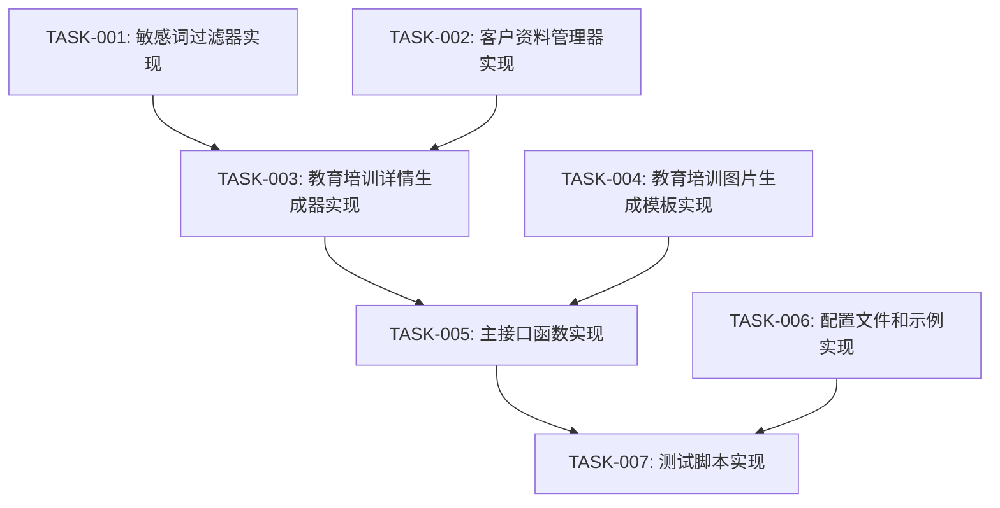

# 教育培训商品详情生成 - 任务拆分文档

## 1. 任务拆分概述

基于设计文档，我们将教育培训商品详情生成系统的开发工作拆分为以下原子任务。每个任务都有明确的输入输出契约、实现约束和依赖关系，确保可以独立执行和验证。

## 2. 原子任务列表

### 2.1 任务1: 敏感词过滤器实现

**任务ID**: TASK-001

**任务描述**: 实现敏感词过滤器，用于检测和过滤生成内容中的敏感词。

**输入契约**:
- 敏感词列表配置
- 待检查的文本内容

**输出契约**:
- `sensitive_word_filter.py` 模块
- `SensitiveWordFilter` 类，包含检查和过滤敏感词的方法

**实现约束**:
- 支持高效的敏感词检测算法
- 支持自定义替换字符
- 返回检测到的敏感词列表

**依赖关系**:
- 无前置依赖
- 后续依赖: TASK-002, TASK-003

### 2.2 任务2: 客户资料管理器实现

**任务ID**: TASK-002

**任务描述**: 实现客户资料管理器，用于处理和验证客户输入的资料。

**输入契约**:
- 客户资料JSON对象

**输出契约**:
- `client_data_manager.py` 模块
- `ClientDataManager` 类，包含验证和处理客户资料的方法

**实现约束**:
- 验证客户资料的完整性
- 提取和标准化客户资料中的关键信息
- 提供友好的错误提示

**依赖关系**:
- 前置依赖: 无
- 后续依赖: TASK-003

### 2.3 任务3: 教育培训详情生成器实现

**任务ID**: TASK-003

**任务描述**: 实现核心的教育培训详情生成器，生成符合规范的商品详情内容。

**输入契约**:
- 客户资料
- 敏感词过滤器
- 配置信息

**输出契约**:
- `education_product_generator.py` 模块
- `EducationProductGenerator` 类，包含生成商品详情各部分的方法

**实现约束**:
- 生成包含标题、老师简介、课程大纲、适用人群、学完收获五部分的内容
- 确保生成内容无敏感词
- 生成内容符合微信小店教育培训类目规则

**依赖关系**:
- 前置依赖: TASK-001, TASK-002
- 后续依赖: TASK-004, TASK-005

### 2.4 任务4: 教育培训图片生成模板实现

**任务ID**: TASK-004

**任务描述**: 实现教育培训类目专用的图片生成模板，适配现有的火山图片生成API。

**输入契约**:
- 客户资料
- 图片生成配置（数量、尺寸等）

**输出契约**:
- `education_image_generator.py` 模块
- 教育培训类目专用的提示词模板
- 主图和详情图生成函数

**实现约束**:
- 支持生成3张主图和2张详情图
- 提示词符合教育培训场景特点
- 与现有的`VolcanoImageGenerator`无缝集成

**依赖关系**:
- 前置依赖: 无（但使用现有的`volcano_image_generator.py`）
- 后续依赖: TASK-005

### 2.5 任务5: 主接口函数实现

**任务ID**: TASK-005

**任务描述**: 实现主接口函数，整合详情生成、图片生成和商品上传功能。

**输入契约**:
- 客户资料
- 配置参数（是否生成图片、是否上传商品等）

**输出契约**:
- 主接口函数 `generate_education_product()`
- 标准化的输出结果格式

**实现约束**:
- 提供灵活的参数配置
- 处理异常情况
- 返回完整的生成结果

**依赖关系**:
- 前置依赖: TASK-003, TASK-004
- 后续依赖: TASK-006

### 2.6 任务6: 配置文件和示例实现

**任务ID**: TASK-006

**任务描述**: 创建配置文件和示例数据，方便系统使用和测试。

**输入契约**:
- 敏感词列表
- 图片生成配置
- 商品配置

**输出契约**:
- `education_product_config.json` 配置文件
- 示例客户资料JSON文件

**实现约束**:
- 配置文件格式清晰易读
- 提供详细的配置说明
- 示例数据具有代表性

**依赖关系**:
- 前置依赖: 无
- 后续依赖: TASK-007

### 2.7 任务7: 测试脚本实现

**任务ID**: TASK-007

**任务描述**: 实现测试脚本，验证系统功能的正确性和稳定性。

**输入契约**:
- 示例客户资料
- 系统配置

**输出契约**:
- `test_education_product.py` 测试脚本
- 测试结果报告

**实现约束**:
- 测试各种场景下的功能
- 验证敏感词过滤效果
- 测试图片生成和商品上传功能

**依赖关系**:
- 前置依赖: TASK-003, TASK-004, TASK-005, TASK-006
- 后续依赖: 无

## 3. 任务依赖图



## 4. 任务执行计划

### 4.1 执行顺序

1. TASK-001: 敏感词过滤器实现
2. TASK-002: 客户资料管理器实现
3. TASK-003: 教育培训详情生成器实现
4. TASK-004: 教育培训图片生成模板实现
5. TASK-005: 主接口函数实现
6. TASK-006: 配置文件和示例实现
7. TASK-007: 测试脚本实现

### 4.2 任务优先级

| 任务ID | 优先级 | 理由 |
|--------|--------|------|
| TASK-001 | 高 | 基础组件，被多个后续任务依赖 |
| TASK-002 | 高 | 基础组件，被教育培训详情生成器依赖 |
| TASK-003 | 最高 | 核心功能，直接关系到系统目标 |
| TASK-004 | 中 | 重要功能，但可以与核心功能并行开发 |
| TASK-005 | 中 | 整合功能，依赖于核心组件 |
| TASK-006 | 低 | 支持性配置，可在开发过程中逐步完善 |
| TASK-007 | 中 | 验证功能，确保系统质量 |

### 4.3 任务估算

| 任务ID | 预计工作量(人天) | 复杂度 | 风险 |
|--------|-----------------|--------|------|
| TASK-001 | 0.5 | 低 | 低 |
| TASK-002 | 0.5 | 低 | 低 |
| TASK-003 | 1 | 中 | 中 |
| TASK-004 | 0.5 | 中 | 中 |
| TASK-005 | 0.5 | 中 | 低 |
| TASK-006 | 0.25 | 低 | 低 |
| TASK-007 | 0.5 | 中 | 低 |

## 5. 接口规范

### 5.1 模块间接口定义

#### 敏感词过滤器接口
```python
def filter_text(self, text, replacement="*"): ...
def contains_sensitive(self, text): ...
def get_detected_words(self, text): ...
```

#### 客户资料管理器接口
```python
def validate_client_data(self, client_data): ...
def process_client_data(self, client_data): ...
```

#### 教育培训详情生成器接口
```python
def generate_details(self, client_data): ...
def validate_details(self, details): ...
```

#### 图片生成模板接口
```python
def generate_main_images(self, client_data, count=3): ...
def generate_detail_images(self, client_data, count=2): ...
```

#### 主接口函数
```python
def generate_education_product(client_data, generate_images=True, upload_product=False): ...
```

## 6. 验收标准

### 6.1 功能验收

| 任务ID | 验收标准 |
|--------|----------|
| TASK-001 | 1. 能正确检测文本中的敏感词<br>2. 能成功过滤敏感词<br>3. 能返回检测到的敏感词列表 |
| TASK-002 | 1. 能验证客户资料的完整性<br>2. 能处理不完整的客户资料并提供错误提示<br>3. 能提取和标准化客户资料中的关键信息 |
| TASK-003 | 1. 能生成包含五部分的商品详情<br>2. 生成内容无敏感词<br>3. 生成内容符合微信小店教育培训类目规则 |
| TASK-004 | 1. 能生成3张主图<br>2. 能生成2张详情图<br>3. 生成的图片符合教育培训场景特点 |
| TASK-005 | 1. 接口函数能正确处理各种参数组合<br>2. 能整合详情生成和图片生成功能<br>3. 能返回标准化的输出结果 |
| TASK-006 | 1. 配置文件格式正确<br>2. 示例数据具有代表性<br>3. 配置说明清晰易懂 |
| TASK-007 | 1. 测试脚本能验证所有功能<br>2. 测试覆盖各种场景<br>3. 测试结果报告完整 |

### 6.2 性能验收

| 任务ID | 性能要求 |
|--------|----------|
| TASK-001 | 敏感词检测速度<1秒/1000字符 |
| TASK-003 | 详情生成时间<3秒/次 |
| TASK-004 | 图片生成时间<60秒/5张 |
| TASK-005 | 整体处理时间<65秒/次(包含图片生成) |

### 6.3 质量验收

| 任务ID | 质量要求 |
|--------|----------|
| 所有任务 | 1. 代码符合PEP8规范<br>2. 包含适当的注释<br>3. 异常处理完善<br>4. 与现有系统集成良好 |