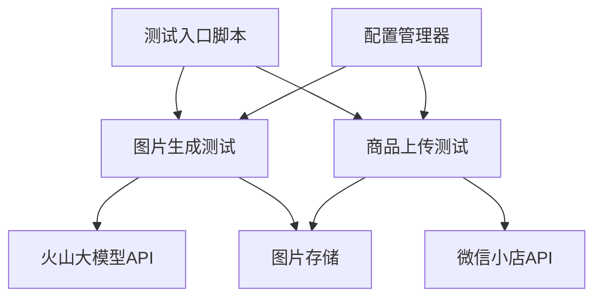
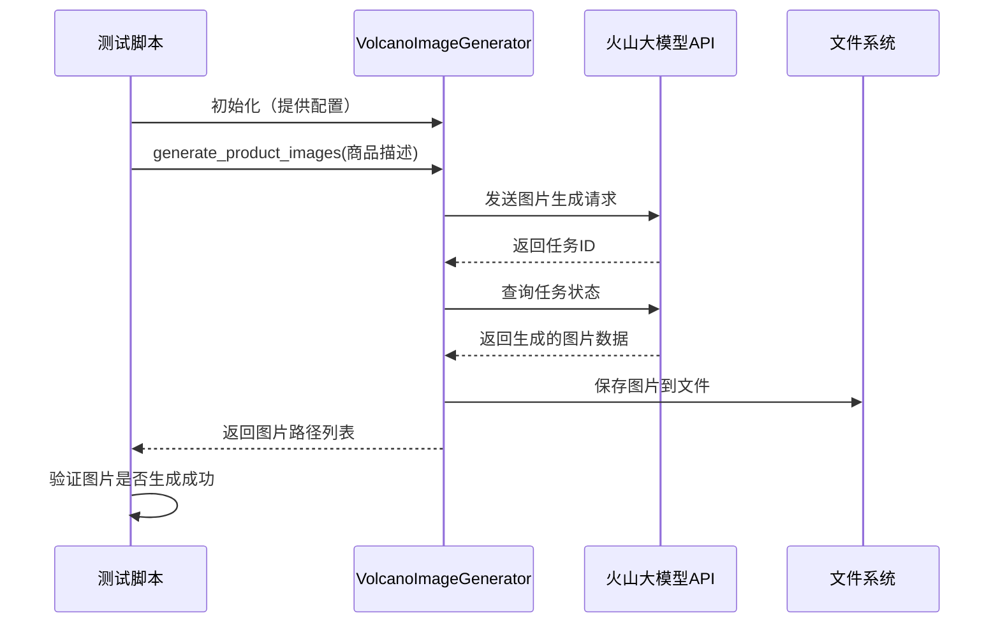
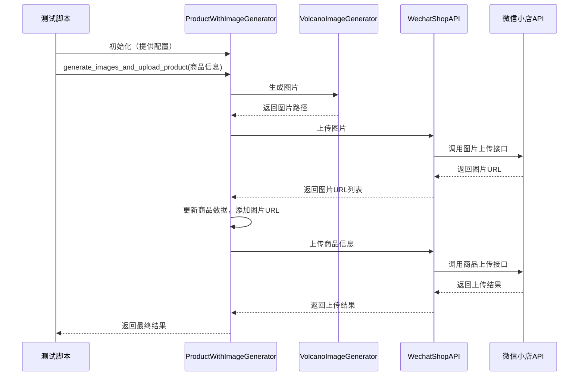

# 测试图片生成和商品上传功能设计文档

## 1. 整体架构



## 2. 模块设计

### 2.1 图片生成测试模块

**功能**：测试火山大模型图片生成功能

**输入**：
- 商品描述文本
- 图片生成配置（模型名称、数量、类型等）

**输出**：
- 生成的图片文件路径
- 测试结果状态（成功/失败）
- 错误信息（如果有）

### 2.2 商品上传测试模块

**功能**：测试商品信息和图片上传到微信小店

**输入**：
- 商品信息（名称、价格、描述等）
- 商品图片路径

**输出**：
- 上传结果状态（成功/失败）
- 商品ID（如果上传成功）
- 错误信息（如果有）

## 3. 测试流程

### 3.1 准备阶段

1. 加载配置（从.env文件或其他配置源）
2. 验证必要的API密钥是否存在
3. 创建临时目录用于存储生成的图片

### 3.2 图片生成测试流程



### 3.3 商品上传测试流程



## 4. 接口设计

### 4.1 测试入口接口

```python
def test_image_generation():
    """
    测试图片生成功能
    Returns:
        dict: 包含测试结果、图片路径等信息
    """
    pass

def test_product_upload(image_paths=None):
    """
    测试商品上传功能
    Args:
        image_paths: 可选，图片路径列表
    Returns:
        dict: 包含上传结果、商品ID等信息
    """
    pass

def run_complete_test():
    """
    运行完整的测试流程（图片生成 + 商品上传）
    Returns:
        dict: 包含完整测试结果
    """
    pass
```

## 5. 数据流向

1. 配置数据 → 配置管理器 → 图片生成器/商品上传器
2. 商品描述 → 图片生成器 → 火山大模型API → 生成的图片
3. 图片文件 → 商品上传器 → 微信小店API
4. 商品信息 + 图片URL → 商品上传器 → 微信小店API
5. 测试结果 → 测试报告

## 6. 异常处理策略

- API调用失败：记录详细错误信息，支持重试机制
- 配置缺失：提供明确的错误提示，指导用户正确配置
- 图片生成失败：检查参数和网络连接，记录详细日志
- 上传失败：区分不同类型的错误（参数错误、权限不足、网络问题等）