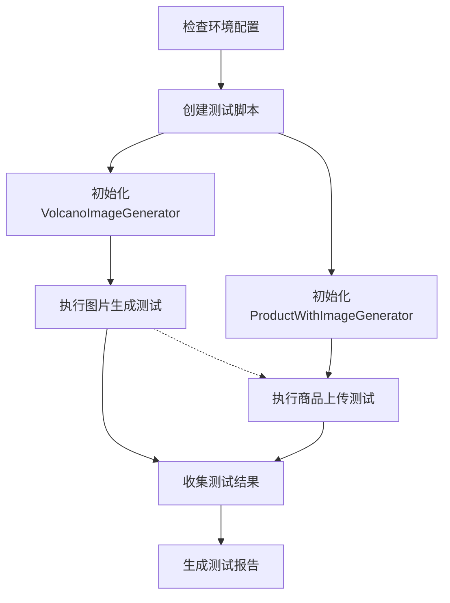

# 测试图片生成和商品上传功能任务拆分文档

## 1. 测试准备任务

### 1.1 检查环境配置

**输入**：
- 项目目录结构
- .env文件配置

**输出**：
- 环境检查结果报告

**依赖**：无

**实现步骤**：
- 检查.env文件是否存在
- 验证必要的API密钥配置（VOLCANO_API_KEY, VOLCANO_MODEL_NAME, WECHAT_APPID, WECHAT_APPSECRET）
- 确认Python环境和依赖库已安装

### 1.2 创建测试脚本

**输入**：
- 设计文档中的测试流程

**输出**：
- 测试脚本文件

**依赖**：
- 完成环境配置检查

**实现步骤**：
- 创建一个新的Python测试脚本
- 实现测试入口函数和辅助函数
- 设置日志记录

## 2. 图片生成测试任务

### 2.1 初始化VolcanoImageGenerator

**输入**：
- 火山大模型API配置

**输出**：
- 初始化完成的VolcanoImageGenerator实例

**依赖**：
- 完成环境配置检查
- 完成测试脚本创建

**实现步骤**：
- 从配置管理器获取火山大模型API配置
- 使用配置初始化VolcanoImageGenerator
- 验证初始化是否成功

### 2.2 执行图片生成测试

**输入**：
- VolcanoImageGenerator实例
- 测试用商品描述

**输出**：
- 生成的图片文件路径列表
- 图片生成状态

**依赖**：
- 完成VolcanoImageGenerator初始化

**实现步骤**：
- 准备测试用商品描述
- 调用generate_product_images方法
- 记录生成过程的日志
- 验证图片是否成功生成

## 3. 商品上传测试任务

### 3.1 初始化ProductWithImageGenerator

**输入**：
- 火山大模型API配置
- 微信小店API配置

**输出**：
- 初始化完成的ProductWithImageGenerator实例

**依赖**：
- 完成环境配置检查
- 完成测试脚本创建

**实现步骤**：
- 从配置管理器获取相关配置
- 初始化ProductWithImageGenerator
- 验证初始化是否成功

### 3.2 执行商品上传测试

**输入**：
- ProductWithImageGenerator实例
- 测试用商品信息
- （可选）已生成的图片路径

**输出**：
- 商品上传结果
- 上传的商品ID（如果成功）

**依赖**：
- 完成ProductWithImageGenerator初始化
- （可选）完成图片生成测试

**实现步骤**：
- 准备测试用商品信息
- 调用generate_images_and_upload_product方法
- 记录上传过程的日志
- 验证上传是否成功

## 4. 测试报告生成任务

### 4.1 收集测试结果

**输入**：
- 图片生成测试结果
- 商品上传测试结果

**输出**：
- 完整的测试结果数据

**依赖**：
- 完成图片生成测试
- 完成商品上传测试

**实现步骤**：
- 收集图片生成测试的详细结果
- 收集商品上传测试的详细结果
- 整合所有测试信息

### 4.2 生成测试报告

**输入**：
- 完整的测试结果数据

**输出**：
- 格式化的测试报告文件

**依赖**：
- 完成测试结果收集

**实现步骤**：
- 生成测试报告文档
- 包含成功/失败状态
- 包含详细的错误信息（如果有）
- 包含生成的图片和上传的商品信息

## 5. 任务依赖关系图

## 6. 验收标准

- 每个子任务都能成功执行并返回预期结果
- 测试脚本能够正确处理各种异常情况
- 测试报告包含完整的测试信息
- 图片生成和商品上传功能能够正常工作