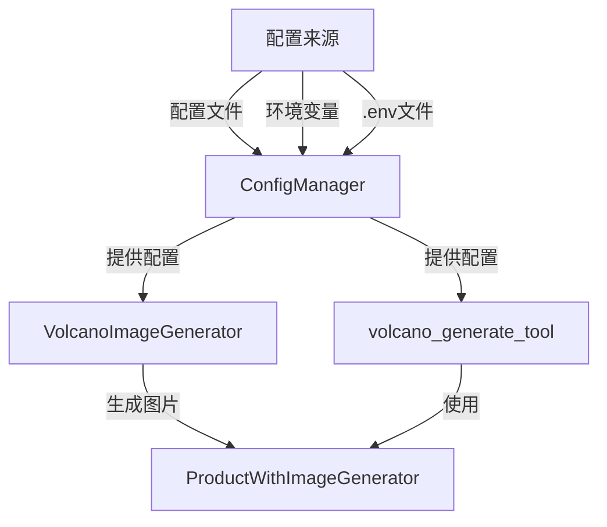
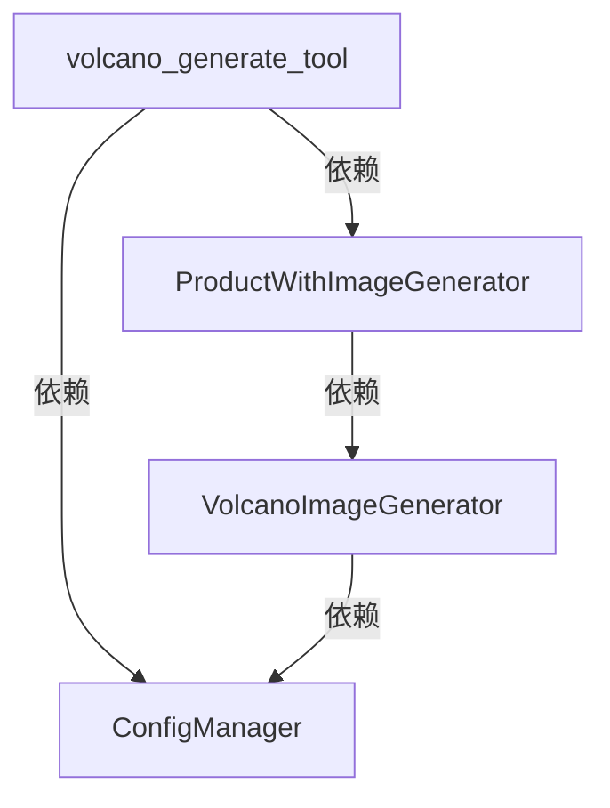
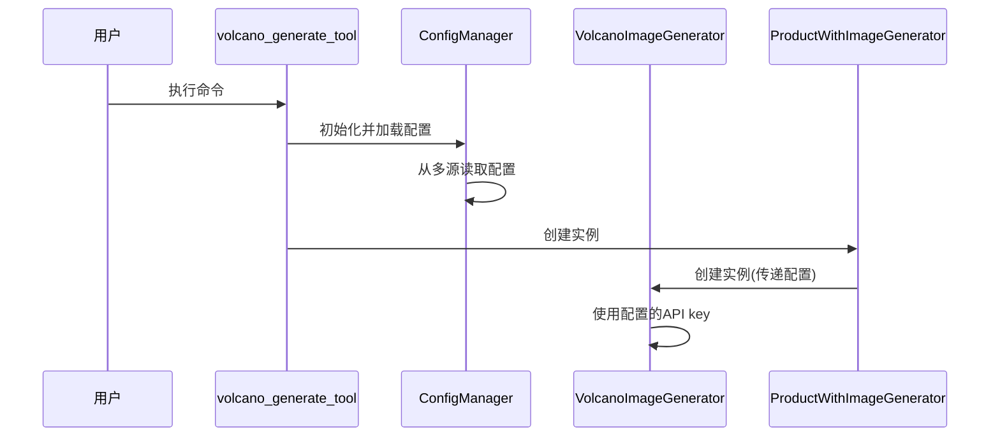

# 火山大模型API配置设计文档

## 整体架构图

## 分层设计和核心组件
1. **配置层**：包括配置文件、环境变量和.env文件
2. **配置管理层**：ConfigManager类，负责读取和管理配置
3. **服务层**：VolcanoImageGenerator类，使用配置的API key调用火山API
4. **业务层**：ProductWithImageGenerator类，使用VolcanoImageGenerator生成商品图片
5. **应用层**：volcano_generate_tool.py，用户交互入口

## 模块依赖关系

## 接口契约定义
1. **ConfigManager**
   - `__init__(config_path=None)`: 初始化配置管理器
   - `load_config()`: 加载配置
   - `get(key, default=None)`: 获取配置项
   - `load_volcano_config()`: 专门加载火山配置，处理优先级

2. **VolcanoImageGenerator**
   - `__init__(config=None, api_key=None)`: 接受配置对象或直接API key

## 数据流向图

## 异常处理策略
1. 当无法读取API key时，提供清晰的错误提示
2. 配置文件不存在时，使用默认配置或从其他来源获取
3. 提供配置验证机制，确保必要的配置项存在