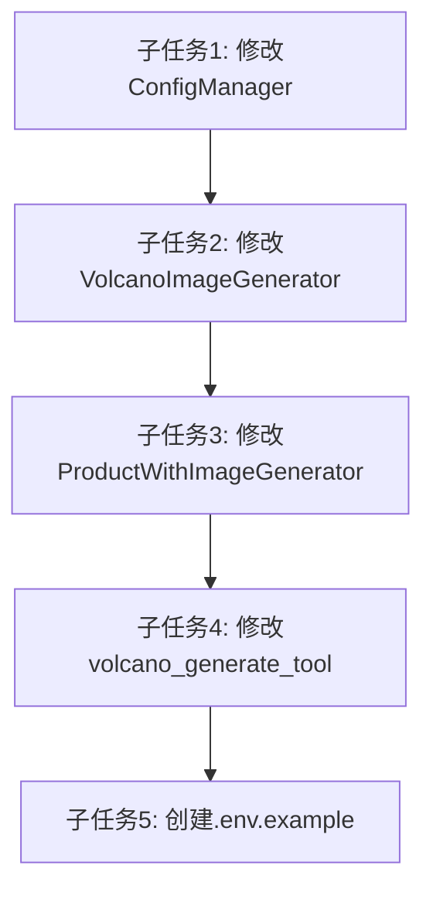

# 火山大模型API配置任务文档

## 子任务1: 修改ConfigManager类支持多源配置

### 输入契约
- 现有ConfigManager类代码
- 项目结构和依赖信息

### 输出契约
- 更新后的ConfigManager类，支持从配置文件、环境变量和.env文件读取火山API配置
- 确保配置优先级：配置文件 > 环境变量 > .env文件

### 实现约束
- 修改config_manager.py文件
- 使用Python标准库和现有依赖
- 保持现有接口的兼容性

### 依赖关系
- 前置任务：无
- 后置任务：修改VolcanoImageGenerator使用配置

## 子任务2: 修改VolcanoImageGenerator使用配置对象

### 输入契约
- 更新后的ConfigManager类
- 现有VolcanoImageGenerator类代码

### 输出契约
- 更新后的VolcanoImageGenerator类，支持接受配置对象
- 能够从配置对象中正确提取API key和其他配置

### 实现约束
- 修改volcano_image_generator.py文件
- 保持向后兼容性，仍支持直接传入API key
- 确保配置正确应用到API调用中

### 依赖关系
- 前置任务：修改ConfigManager类支持多源配置
- 后置任务：修改ProductWithImageGenerator使用配置

## 子任务3: 修改ProductWithImageGenerator使用配置对象

### 输入契约
- 更新后的VolcanoImageGenerator类
- 现有ProductWithImageGenerator类代码

### 输出契约
- 更新后的ProductWithImageGenerator类，能够正确传递配置对象给VolcanoImageGenerator
- 移除冗余的API key处理逻辑

### 实现约束
- 修改product_with_image_generator.py文件
- 保持与现有功能的一致性
- 优化配置传递逻辑

### 依赖关系
- 前置任务：修改VolcanoImageGenerator使用配置对象
- 后置任务：修改volcano_generate_tool使用配置

## 子任务4: 修改volcano_generate_tool使用配置

### 输入契约
- 更新后的ConfigManager、VolcanoImageGenerator和ProductWithImageGenerator类
- 现有volcano_generate_tool.py代码

### 输出契约
- 更新后的volcano_generate_tool.py，正确初始化ConfigManager并传入配置文件路径
- 确保在所有需要的地方都正确使用配置

### 实现约束
- 修改volcano_generate_tool.py文件中的ConfigManager初始化
- 确保交互式和命令行模式都能正确使用配置

### 依赖关系
- 前置任务：修改ProductWithImageGenerator使用配置对象
- 后置任务：创建.env.example文件

## 子任务5: 创建.env.example示例文件

### 输入契约
- 项目所需的所有环境变量信息

### 输出契约
- .env.example文件，包含所有需要的环境变量及其说明
- 确保不包含真实的API密钥

### 实现约束
- 在项目根目录创建文件
- 提供清晰的变量说明

### 依赖关系
- 前置任务：修改volcano_generate_tool使用配置

## 任务依赖图
