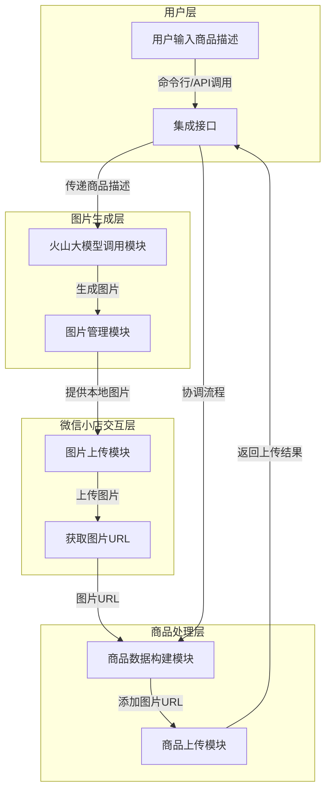
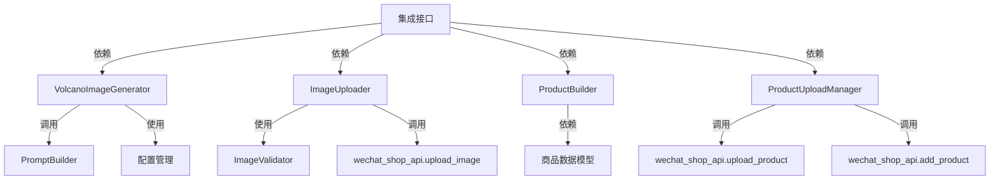
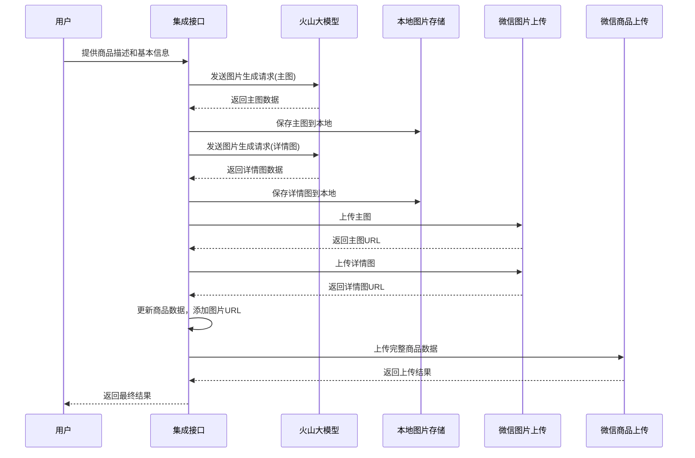

# 火山大模型图片生成集成 - 设计文档

## 1. 整体架构图



## 2. 分层设计和核心组件

### 2.1 用户层

**功能**: 提供用户交互接口，接收商品描述和配置信息

**核心组件**:
- **集成接口**: 提供命令行工具和编程接口，接收用户输入并协调整个流程
- **配置管理**: 从环境变量和配置文件读取API密钥和参数设置

### 2.2 图片生成层

**功能**: 负责调用火山大模型API生成商品图片

**核心组件**:
- **VolcanoImageGenerator**: 核心类，负责与火山大模型API交互
  - 管理API密钥和请求参数
  - 构建提示词
  - 发送图片生成请求
  - 处理API响应
- **PromptBuilder**: 负责根据商品描述生成合适的提示词
  - 为不同类型的图片（主图/详情图）生成不同的提示词
  - 优化提示词以获得更好的生成效果

### 2.3 微信小店交互层

**功能**: 负责将生成的图片上传到微信小店

**核心组件**:
- **ImageUploader**: 重用现有的图片上传功能
  - 上传本地图片到微信小店
  - 获取上传后的图片URL
- **ImageValidator**: 验证图片格式、尺寸和大小是否符合要求
  - 检查图片格式（JPG/PNG）
  - 检查图片大小（不超过1MB）
  - 可选：调整图片尺寸以满足要求

### 2.4 商品处理层

**功能**: 构建商品数据并上传到微信小店

**核心组件**:
- **ProductBuilder**: 负责构建完整的商品数据
  - 将生成的图片URL添加到商品数据中
  - 确保所有必填字段都已填写
- **ProductUploadManager**: 负责商品上传过程的管理
  - 调用现有的商品上传功能
  - 处理上传结果和错误

## 3. 模块依赖关系图



## 4. 接口契约定义

### 4.1 VolcanoImageGenerator 类

```python
class VolcanoImageGenerator:
    def __init__(self, api_key, api_base_url=None):
        # 初始化火山大模型API客户端
        # 参数:
        #   api_key: 火山大模型API密钥
        #   api_base_url: API基础URL，可选
        pass
    
    def generate_product_images(self, product_description, count=3, image_type="main"):
        # 生成商品图片
        # 参数:
        #   product_description: 商品描述文本
        #   count: 生成图片数量
        #   image_type: 图片类型 ("main" 或 "detail")
        # 返回:
        #   生成的图片文件路径列表
        pass
    
    def _build_prompt(self, product_description, image_type):
        # 构建提示词
        # 参数:
        #   product_description: 商品描述文本
        #   image_type: 图片类型
        # 返回:
        #   构建好的提示词字符串
        pass
```

### 4.2 ProductWithImageGenerator 类

```python
class ProductWithImageGenerator:
    def __init__(self, wechat_api_client, volcano_api_key):
        # 初始化集成类
        # 参数:
        #   wechat_api_client: 微信小店API客户端实例
        #   volcano_api_key: 火山大模型API密钥
        pass
    
    def generate_images_and_upload_product(self, product_description, product_data):
        # 生成图片并上传商品
        # 参数:
        #   product_description: 商品描述文本
        #   product_data: 商品基本数据
        # 返回:
        #   上传结果
        pass
    
    def _upload_generated_images(self, image_paths):
        # 上传生成的图片
        # 参数:
        #   image_paths: 图片文件路径列表
        # 返回:
        #   上传后的图片URL列表
        pass
    
    def _update_product_data_with_images(self, product_data, main_image_urls, detail_image_urls):
        # 更新商品数据，添加图片URL
        # 参数:
        #   product_data: 原始商品数据
        #   main_image_urls: 主图URL列表
        #   detail_image_urls: 详情图URL列表
        # 返回:
        #   更新后的商品数据
        pass
```

## 5. 数据流向图



## 6. 异常处理策略

### 6.1 API调用异常

- **火山大模型API调用失败**:
  - 实现重试机制（最多3次，指数退避）
  - 记录详细错误信息
  - 返回友好的错误提示

- **微信小店API调用失败**:
  - 复用现有的错误处理逻辑
  - 针对图片上传和商品上传分别处理错误

### 6.2 图片生成异常

- **生成图片质量不佳**:
  - 提供重新生成选项
  - 记录生成失败的提示词，用于后续优化

- **图片格式不符合要求**:
  - 尝试自动转换格式
  - 如果转换失败，提示用户手动处理

### 6.3 流程异常

- **部分步骤失败**:
  - 实现事务式处理，关键步骤失败时回滚
  - 保存中间结果，支持断点续传

- **系统资源不足**:
  - 限制并发请求数量
  - 实现队列机制处理大批量请求

## 7. 设计原则

### 7.1 模块化设计
- 将功能拆分为独立的模块，便于维护和扩展
- 遵循单一职责原则，每个模块只负责一个功能

### 7.2 可扩展性
- 设计灵活的接口，便于替换或升级组件
- 支持配置化的参数设置，适应不同场景

### 7.3 代码复用
- 尽可能重用现有的代码和功能
- 与现有系统保持一致的设计风格

### 7.4 安全性
- 敏感信息（如API密钥）通过环境变量或配置文件管理
- 实现适当的权限控制和访问限制

### 7.5 可测试性
- 提供单元测试和集成测试
- 设计清晰的接口便于模拟和测试