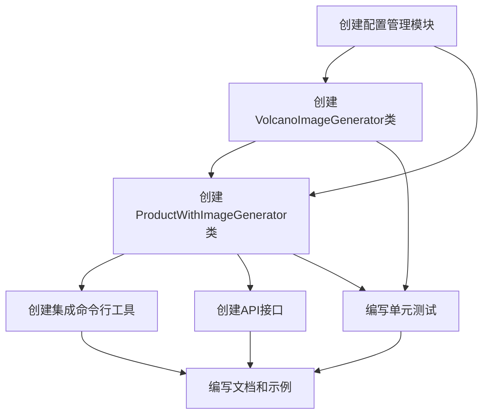

# 火山大模型图片生成集成 - 任务拆分

## 1. 任务依赖图

## 2. 原子任务定义

### 2.1 T1: 创建VolcanoImageGenerator类

**输入契约**:
- 环境依赖: requests库
- 配置依赖: 火山大模型API密钥

**输出契约**:
- 文件: `volcano_image_generator.py`
- 功能: 能够调用火山大模型API生成商品图片

**实现约束**:
- 实现重试机制（最多3次）
- 实现提示词构建功能
- 保存生成的图片到本地临时目录
- 遵循现有代码风格

**验收标准**:
- 成功生成指定数量的图片
- 处理API错误和异常情况
- 代码通过单元测试

### 2.2 T2: 创建配置管理模块

**输入契约**:
- 配置文件格式规范
- 环境变量命名规范

**输出契约**:
- 文件: `config_manager.py`
- 功能: 从环境变量或配置文件加载API密钥和参数

**实现约束**:
- 优先从环境变量读取，其次从配置文件读取
- 提供默认配置值
- 支持不同环境（开发、测试、生产）的配置

**验收标准**:
- 正确读取环境变量中的配置
- 正确读取配置文件中的配置
- 提供合理的默认值

### 2.3 T3: 创建ProductWithImageGenerator类

**输入契约**:
- 依赖: VolcanoImageGenerator类
- 依赖: wechat_shop_api模块中的上传功能
- 环境依赖: 微信小店API配置

**输出契约**:
- 文件: `product_with_image_generator.py`
- 功能: 协调整个流程（生成图片、上传图片、更新商品数据、上传商品）

**实现约束**:
- 生成3张主图和2张详情图
- 正确处理微信小店API的响应
- 实现错误处理和恢复机制

**验收标准**:
- 成功生成图片并上传到微信小店
- 成功更新商品数据并上传
- 处理各种异常情况

### 2.4 T4: 创建集成命令行工具

**输入契约**:
- 依赖: ProductWithImageGenerator类
- 用户输入格式规范

**输出契约**:
- 文件: `cli.py`
- 功能: 提供命令行界面，接收用户输入的商品描述和参数

**实现约束**:
- 支持参数化输入
- 提供清晰的使用说明
- 显示进度信息

**验收标准**:
- 命令行工具运行正常
- 正确处理命令行参数
- 提供友好的输出和错误提示

### 2.5 T5: 创建API接口

**输入契约**:
- 依赖: ProductWithImageGenerator类
- API接口规范

**输出契约**:
- 文件: `api.py`
- 功能: 提供RESTful API接口，供其他系统调用

**实现约束**:
- 实现标准的HTTP方法
- 提供JSON格式的请求和响应
- 实现基本的错误处理

**验收标准**:
- API接口运行正常
- 正确处理请求参数
- 返回正确的响应格式

### 2.6 T6: 编写文档和示例

**输入契约**:
- 已实现的功能模块
- 使用场景和示例

**输出契约**:
- 文件: `README.md`
- 文件: `examples/usage_example.py`
- 功能: 详细的使用说明和示例代码

**实现约束**:
- 文档清晰易懂
- 示例代码可运行
- 包含常见问题和解决方案

**验收标准**:
- 文档完整，包含所有必要信息
- 示例代码能够正常运行
- 用户能够根据文档快速上手

### 2.7 T7: 编写单元测试

**输入契约**:
- 已实现的功能模块
- 测试用例设计

**输出契约**:
- 文件: `tests/test_volcano_image_generator.py`
- 文件: `tests/test_product_with_image_generator.py`
- 功能: 测试各个模块的功能和边界条件

**实现约束**:
- 测试覆盖率达到80%以上
- 包含正常情况、边界情况和异常情况的测试
- 使用mock模拟外部API调用

**验收标准**:
- 所有测试用例通过
- 测试覆盖率符合要求
- 能够发现潜在的问题

## 3. 任务执行顺序

1. T2: 创建配置管理模块
2. T1: 创建VolcanoImageGenerator类
3. T3: 创建ProductWithImageGenerator类
4. T4: 创建集成命令行工具
5. T5: 创建API接口
6. T7: 编写单元测试
7. T6: 编写文档和示例

## 4. 资源需求

### 4.1 开发环境
- Python 3.7+
- requests库
- pytest库（用于测试）

### 4.2 API资源
- 火山大模型API密钥
- 微信小店API配置

### 4.3 存储资源
- 本地临时目录（用于保存生成的图片）

## 5. 风险管理

### 5.1 API调用限制
- 风险: 火山大模型API可能有调用频率限制
- 缓解措施: 实现请求节流和重试机制

### 5.2 图片质量问题
- 风险: 生成的图片质量可能不符合要求
- 缓解措施: 优化提示词，提供重新生成选项

### 5.3 错误处理
- 风险: 中间步骤失败导致整个流程中断
- 缓解措施: 实现断点续传和错误恢复机制

## 6. 验收标准

### 6.1 功能验收
- 成功调用火山大模型生成3张主图和2张详情图
- 成功上传生成的图片到微信小店
- 成功将图片URL添加到商品数据中
- 成功上传完整的商品数据到微信小店

### 6.2 性能验收
- 整个流程（从生成图片到上传商品）在可接受的时间内完成
- 能够处理并发请求

### 6.3 质量验收
- 代码符合Python编码规范
- 测试覆盖率达到80%以上
- 文档完整清晰

### 6.4 集成验收
- 与现有微信小店API无缝集成
- 不影响现有功能的正常运行