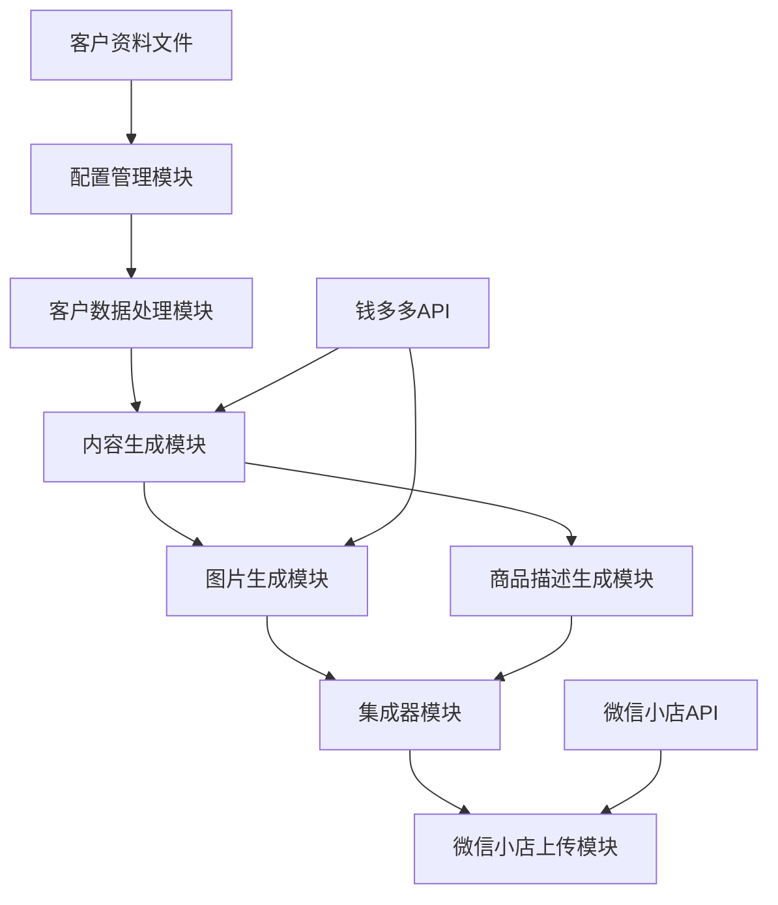
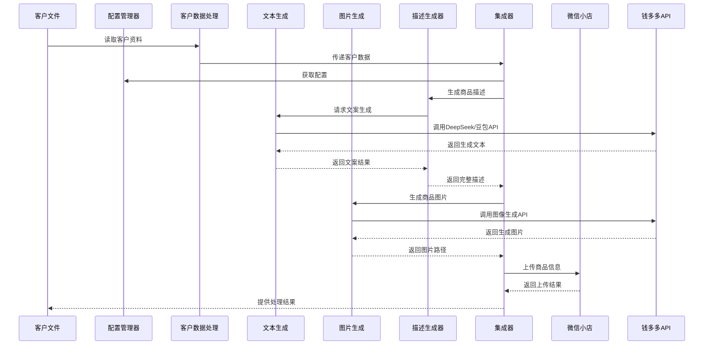

# 教育培训商品自动生成与上传系统

## 1. 项目概述

本系统设计用于自动化处理教育培训商品的全流程管理，包括从客户文件读取信息，使用AI模型（DeepSeek和豆包）生成商品文案、标题和图片，创建符合微信小店规范的商品详情页，并最终将商品上传到微信小店平台完成发布。

## 2. 系统架构

### 2.1 整体架构图

### 2.2 核心组件说明

#### 2.2.1 配置管理模块 (ConfigManager)

- **功能**: 统一管理系统所有配置，包括API密钥、模型设置、生成参数等
- **特点**: 
  - 支持多源配置（环境变量、配置文件、默认值）
  - 优先级机制确保配置正确性
  - 配置验证确保系统稳定性
- **主要文件**: `config_manager.py`

#### 2.2.2 客户数据处理模块 (ClientDataManager)

- **功能**: 读取和解析客户资料文件
- **支持格式**: JSON、Markdown
- **数据验证**: 确保客户资料完整性和正确性
- **主要文件**: 集成在`generate_educational_product.py`中

#### 2.2.3 内容生成模块

- **功能**: 使用DeepSeek和豆包API生成商品文案、标题等文本内容
- **主要组件**: `VolcanoTextGenerator`
- **核心功能**: 
  - 信息提取
  - 文案生成
  - 格式标准化
- **主要文件**: `volcano_text_generator.py`

#### 2.2.4 图片生成模块

- **功能**: 生成商品主图和详情页图片
- **主要组件**: `VolcanoImageGenerator`
- **图片类型**: 
  - 主图：展示课程主题和亮点
  - 详情图：展示课程内容和价值
- **主要文件**: `volcano_image_generator.py`

#### 2.2.5 商品描述生成模块

- **功能**: 生成符合微信小店规则的商品详情页
- **主要组件**: `ProductDescriptionGenerator`
- **生成内容**: 
  - 商品标题
  - 老师简介
  - 课程大纲
  - 适用人群
  - 学完收获
- **主要文件**: `product_description_generator.py`

#### 2.2.6 集成器模块

- **功能**: 整合各个模块的功能，协调工作流程
- **主要组件**: `ImageGenerationIntegrator`
- **工作流程**: 
  - 加载客户资料
  - 生成商品描述
  - 生成商品图片
  - 验证生成结果
  - 保存处理结果
- **主要文件**: `image_generation_integrator.py`

#### 2.2.7 微信小店上传模块

- **功能**: 将生成的商品信息上传到微信小店
- **主要功能**: 
  - 获取访问令牌
  - 准备商品数据
  - 调用微信小店API
  - 处理上传结果
- **主要文件**: `backup/test_upload_product_from_csv.py`

## 3. 数据流和处理流程

### 3.1 数据流程图

### 3.2 主要处理流程

1. **初始化流程**
   - 加载配置（API密钥、模型设置等）
   - 初始化各模块组件
   - 验证配置有效性

2. **客户资料处理**
   - 读取客户资料文件
   - 解析和验证数据结构
   - 提取关键信息

3. **商品内容生成**
   - 生成商品标题
   - 生成课程大纲
   - 生成适用人群描述
   - 生成学习收获描述

4. **图片生成**
   - 构建主图提示词
   - 生成主图
   - 构建详情图提示词
   - 生成详情图
   - 验证图片质量

5. **商品上传**
   - 获取微信小店访问令牌
   - 准备商品数据
   - 上传商品信息
   - 处理上传结果

## 4. 技术栈和依赖

| 类别 | 技术/库 | 用途 | 来源 |
| --- | --- | --- | --- |
| 主要语言 | Python | 系统开发 | 所有源文件 |
| HTTP客户端 | requests | API调用 | `volcano_text_generator.py`, `backup/test_upload_product_from_csv.py` |
| 数据处理 | json, os, re | 数据解析和处理 | 所有源文件 |
| 配置管理 | python-dotenv | 环境变量管理 | `config_manager.py` |
| AI模型 | DeepSeek, 豆包 | 文本和图像生成 | `volcano_text_generator.py`, `volcano_image_generator.py` |
| 外部API | 钱多多API | AI模型调用 | `config_manager.py` |
| 外部API | 微信小店API | 商品上传 | `backup/test_upload_product_from_csv.py` |

## 5. 配置管理

系统使用多级配置机制，优先级从高到低：

1. **环境变量**：敏感信息如API密钥
2. **配置文件**：产品特定配置
3. **默认配置**：系统内置默认值

主要配置项：

- **钱多多API配置**：
  - `api_key`：API密钥
  - `model_name`：使用的模型名称（如DeepSeek-V3.1）
  - `base_url`：API基础URL

- **生成配置**：
  - `main_images_count`：主图数量
  - `detail_images_count`：详情图数量

- **上传配置**：
  - 微信小店相关配置

## 6. 错误处理和日志

系统实现了全面的错误处理机制：

- **异常捕获**：各关键操作均有异常捕获
- **日志记录**：详细记录操作过程和错误信息
- **结果验证**：生成内容和图片的质量验证
- **重试机制**：网络请求失败的重试逻辑

## 7. 扩展性设计

系统采用模块化设计，具有良好的扩展性：

- **配置驱动**：通过配置文件调整系统行为，无需修改代码
- **接口隔离**：各模块通过清晰的接口交互
- **可替换组件**：AI模型和上传模块可独立替换
- **易于扩展**：可轻松添加新的生成器或上传器

## 8. 安全考虑

- **API密钥保护**：使用环境变量管理敏感信息
- **错误信息控制**：生产环境不暴露详细错误信息
- **输入验证**：严格验证客户资料和生成内容
- **异常处理**：防止未处理异常导致系统崩溃

## 9. 部署和使用

### 9.1 环境准备

1. 安装Python 3.8+
2. 安装依赖库：`pip install -r requirements.txt`
3. 配置环境变量：
   - `QDD_API_KEY`：钱多多API密钥
   - 微信小店相关配置

### 9.2 使用流程

1. 准备客户资料文件（JSON或Markdown格式）
2. 运行主程序：`python generate_educational_product.py --input_file <客户资料文件> --output_dir <输出目录>`
3. 查看生成的商品信息和图片
4. 使用上传脚本将商品上传到微信小店：`python backup/test_upload_product_from_csv.py`

## 10. 总结

本系统实现了教育培训商品从信息读取、内容生成到微信小店上传的全流程自动化，通过合理的架构设计和模块化实现，确保了系统的可维护性和扩展性。系统利用AI技术（DeepSeek和豆包）提升了内容生成的质量和效率，大大减少了人工操作的工作量。