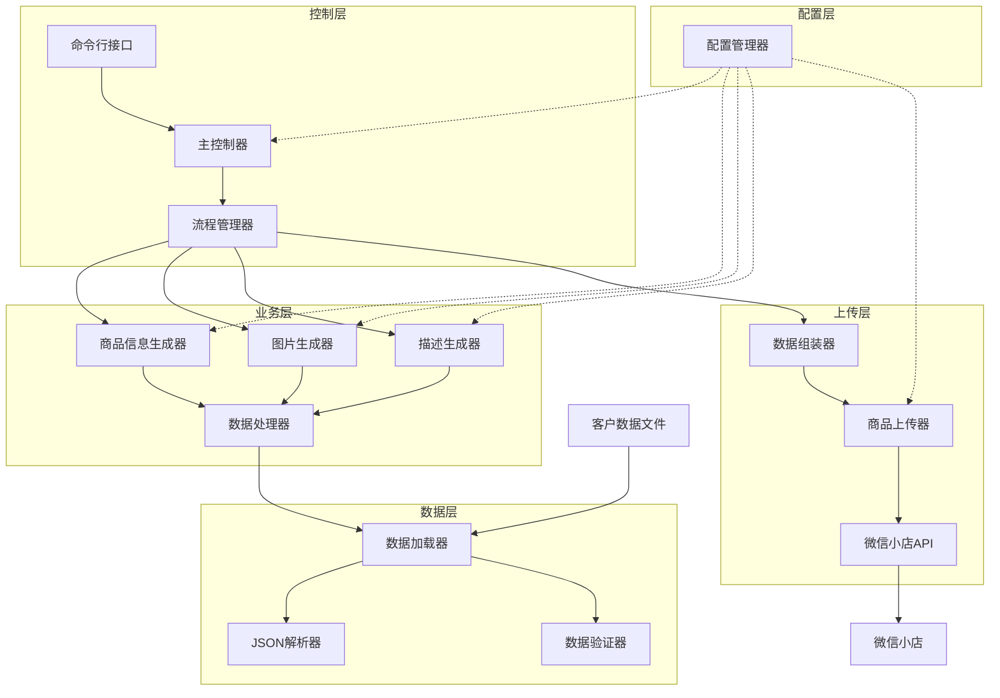
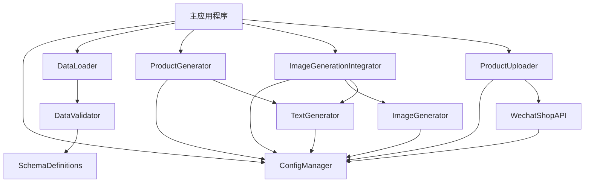
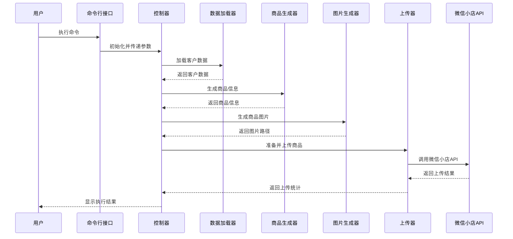

# 教育培训商品自动生成与上传系统 - 重构设计文档

## 1. 整体架构图



## 2. 分层设计和核心组件

### 2.1 控制层

**功能**：提供用户接口，协调各模块工作，控制整体流程。

**核心组件**：
- **命令行接口**：处理用户输入的命令和参数
- **主控制器**：初始化系统组件，调用流程管理器
- **流程管理器**：编排业务流程，协调各模块执行

### 2.2 业务层

**功能**：实现核心业务逻辑，包括商品信息生成、图片生成和描述生成。

**核心组件**：
- **商品信息生成器**：生成商品标题、价格等基本信息
- **图片生成器**：调用AI模型生成商品主图和详情图
- **描述生成器**：生成商品描述文本
- **数据处理器**：处理和转换客户数据供业务层使用

### 2.3 数据层

**功能**：负责数据的读取、解析和验证。

**核心组件**：
- **数据加载器**：从文件加载客户数据
- **JSON解析器**：解析JSON格式的客户数据
- **数据验证器**：验证数据格式和内容的有效性

### 2.4 上传层

**功能**：组装商品数据，调用微信小店API上传商品。

**核心组件**：
- **数据组装器**：将生成的信息组装成微信小店API所需格式
- **商品上传器**：调用微信小店API上传商品
- **微信小店API**：封装微信小店API调用

### 2.5 配置层

**功能**：统一管理系统配置，提供配置访问接口。

**核心组件**：
- **配置管理器**：加载、解析和提供配置信息

## 3. 模块依赖关系图



## 4. 接口契约定义

### 4.1 数据加载接口

```python
class DataLoader:
    def load_client_data(self, file_path: str) -> dict:
        """
        从文件加载客户数据
        
        参数:
            file_path: 数据文件路径
            
        返回:
            客户数据字典
            
        异常:
            FileNotFoundError: 文件不存在
            ValueError: 文件格式错误或数据无效
        """
        pass
        
    def validate_data(self, data: dict) -> bool:
        """
        验证客户数据的有效性
        
        参数:
            data: 客户数据字典
            
        返回:
            是否有效
            
        异常:
            ValueError: 数据无效时抛出，包含错误详情
        """
        pass
```

### 4.2 商品生成接口

```python
class ProductGenerator:
    def __init__(self, config: dict):
        """
        初始化商品生成器
        
        参数:
            config: 配置字典
        """
        pass
    
    def generate_product_info(self, client_data: dict) -> dict:
        """
        基于客户数据生成商品信息
        
        参数:
            client_data: 客户数据字典
            
        返回:
            生成的商品信息字典，包含标题、描述等
        """
        pass
```

### 4.3 图片生成接口

```python
class ImageGenerationIntegrator:
    def __init__(self, config: dict):
        """
        初始化图片生成集成器
        
        参数:
            config: 配置字典
        """
        pass
    
    def generate_images(self, product_info: dict, callback=None) -> dict:
        """
        生成商品图片
        
        参数:
            product_info: 商品信息字典
            callback: 进度回调函数
            
        返回:
            包含生成图片路径的结果字典
        """
        pass
```

### 4.4 商品上传接口

```python
class ProductUploader:
    def __init__(self, config: dict):
        """
        初始化商品上传器
        
        参数:
            config: 配置字典
        """
        pass
    
    def prepare_product_data(self, product_info: dict, image_results: dict) -> dict:
        """
        准备商品上传数据
        
        参数:
            product_info: 商品信息字典
            image_results: 图片生成结果字典
            
        返回:
            符合微信小店API格式的商品数据
        """
        pass
    
    async def upload_products_async(self, products: list) -> dict:
        """
        异步上传商品
        
        参数:
            products: 商品数据列表
            
        返回:
            上传结果统计
        """
        pass
    
    def upload_products(self, products: list) -> dict:
        """
        同步上传商品
        
        参数:
            products: 商品数据列表
            
        返回:
            上传结果统计
        """
        pass
```

## 5. 数据流向图



## 6. 异常处理策略

### 6.1 异常类型

1. **数据相关异常**：
   - `FileNotFoundError`: 文件不存在
   - `ValueError`: 数据格式错误或无效
   - `JSONDecodeError`: JSON解析错误

2. **配置相关异常**：
   - `ConfigError`: 配置缺失或无效
   - `APIKeyError`: API密钥缺失或无效

3. **API调用异常**：
   - `APIRequestError`: API请求失败
   - `APIAuthError`: API认证失败
   - `APIQuotaError`: API配额耗尽

4. **系统异常**：
   - `SystemError`: 系统内部错误
   - `ResourceError`: 资源（如磁盘空间）不足

### 6.2 处理策略

1. **错误捕获**：在适当的层级捕获异常，避免异常直接暴露给用户
2. **日志记录**：详细记录异常信息，包括错误类型、消息和堆栈
3. **用户提示**：向用户提供友好的错误提示，说明问题和可能的解决方案
4. **重试机制**：对可恢复的错误（如网络问题）实现自动重试
5. **优雅退出**：在发生致命错误时，确保资源被正确释放后退出

### 6.3 错误响应格式

```python
error_response = {
    "success": False,
    "error_code": "ERROR_CODE",  # 错误代码
    "error_message": "详细错误信息",  # 用户友好的错误消息
    "details": {...}  # 附加的错误详情
}
```

## 7. 配置管理策略

1. **配置优先级**：
   - 命令行参数 > 环境变量 > 配置文件 > 默认值

2. **配置验证**：
   - 在加载配置时验证必填项
   - 验证配置值的有效性（如数值范围、格式等）

3. **敏感信息处理**：
   - API密钥等敏感信息通过环境变量或.env文件提供
   - 在日志中隐藏敏感信息

4. **配置缓存**：
   - 配置加载后缓存，避免重复加载
   - 支持配置热更新（可选）

## 8. 实现注意事项

1. **依赖注入**：使用依赖注入模式，便于测试和组件替换
2. **接口隔离**：确保模块间通过清晰的接口通信
3. **单一职责**：每个类和函数只负责一个具体功能
4. **代码复用**：提取公共功能为工具函数或基类
5. **向后兼容**：确保与现有系统的兼容性

通过以上设计，系统将具备更好的可维护性、可扩展性和可靠性，同时保持与现有功能的兼容性。