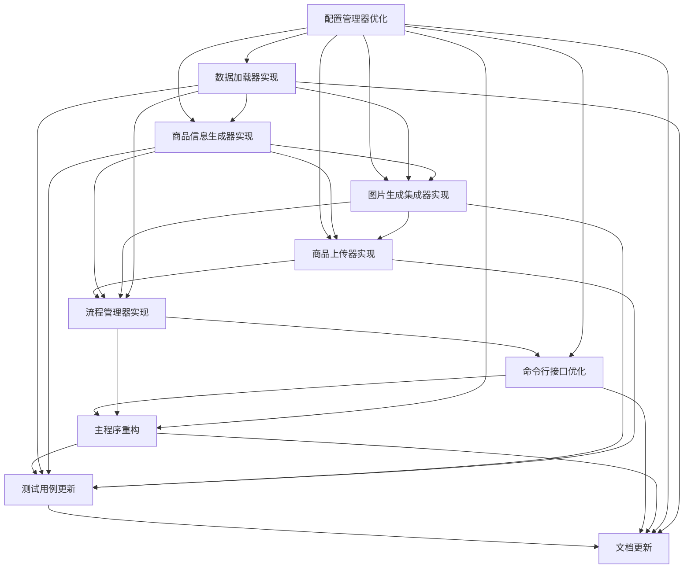

# 教育培训商品自动生成与上传系统 - 任务拆分文档

## 1. 任务列表

### 1.1 配置管理器优化

**任务ID**: TASK-001

**描述**: 优化配置管理器，实现配置文件加载、环境变量支持、配置验证和默认值合并。

**输入契约**:
- 配置文件路径: `product_generator_config.json`
- 环境变量: API_KEY, API_URL等

**输出契约**:
- 配置管理器类: `ConfigManager`
- 配置验证方法
- 各模块配置获取方法

**实现约束**:
- 使用Python标准库处理JSON和环境变量
- 实现配置优先级: 命令行 > 环境变量 > 配置文件 > 默认值
- 隐藏敏感配置信息

**依赖关系**:
- 前置任务: 无
- 后置任务: TASK-002, TASK-003, TASK-004, TASK-005

**复杂度**: 中等

### 1.2 数据加载器实现

**任务ID**: TASK-002

**描述**: 实现数据加载器，支持从JSON文件加载客户数据，并进行数据验证。

**输入契约**:
- 客户数据文件路径
- 数据验证模式

**输出契约**:
- 数据加载器类: `DataLoader`
- 数据加载方法
- 数据验证方法

**实现约束**:
- 支持JSON格式的数据文件
- 实现数据格式和内容验证
- 抛出明确的错误信息

**依赖关系**:
- 前置任务: TASK-001
- 后置任务: TASK-003, TASK-004

**复杂度**: 低

### 1.3 商品信息生成器实现

**任务ID**: TASK-003

**描述**: 实现商品信息生成器，基于客户数据生成商品标题、描述等信息。

**输入契约**:
- 客户数据字典
- 生成器配置

**输出契约**:
- 商品信息生成器类: `ProductGenerator`
- 商品信息生成方法

**实现约束**:
- 基于客户提供的课程信息生成商品数据
- 支持多语言生成（可选）
- 确保生成的信息符合微信小店要求

**依赖关系**:
- 前置任务: TASK-001, TASK-002
- 后置任务: TASK-004, TASK-005

**复杂度**: 中等

### 1.4 图片生成集成器实现

**任务ID**: TASK-004

**描述**: 实现图片生成集成器，调用AI模型生成商品主图和详情图。

**输入契约**:
- 商品信息字典
- 图片生成配置

**输出契约**:
- 图片生成集成器类: `ImageGenerationIntegrator`
- 图片生成方法
- 进度回调机制

**实现约束**:
- 支持异步图片生成
- 实现错误重试机制
- 保存生成的图片到指定目录

**依赖关系**:
- 前置任务: TASK-001, TASK-002, TASK-003
- 后置任务: TASK-005

**复杂度**: 高

### 1.5 商品上传器实现

**任务ID**: TASK-005

**描述**: 实现商品上传器，组装商品数据并调用微信小店API上传商品。

**输入契约**:
- 商品信息字典
- 图片生成结果字典
- 上传配置

**输出契约**:
- 商品上传器类: `ProductUploader`
- 数据组装方法
- 同步和异步上传方法

**实现约束**:
- 支持批量上传
- 实现异步上传模式
- 提供上传进度和结果报告

**依赖关系**:
- 前置任务: TASK-001, TASK-003, TASK-004
- 后置任务: TASK-006

**复杂度**: 高

### 1.6 流程管理器实现

**任务ID**: TASK-006

**描述**: 实现流程管理器，协调各模块工作，控制整体流程。

**输入契约**:
- 客户数据文件路径
- 输出目录
- 配置选项

**输出契约**:
- 流程管理器类: `FlowManager`
- 完整流程执行方法
- 结果统计和报告方法

**实现约束**:
- 支持完整的生成-上传流程
- 提供详细的执行日志
- 处理中间结果保存和恢复

**依赖关系**:
- 前置任务: TASK-002, TASK-003, TASK-004, TASK-005
- 后置任务: TASK-007

**复杂度**: 中等

### 1.7 命令行接口优化

**任务ID**: TASK-007

**描述**: 优化命令行接口，支持新的数据流和参数选项。

**输入契约**:
- 命令行参数
- 配置文件路径

**输出契约**:
- 命令行解析器
- 子命令处理器
- 帮助文档

**实现约束**:
- 支持输入文件指定
- 支持输出目录指定
- 提供详细的帮助信息
- 保持与现有命令格式的兼容性

**依赖关系**:
- 前置任务: TASK-001, TASK-006
- 后置任务: TASK-008

**复杂度**: 低

### 1.8 主程序重构

**任务ID**: TASK-008

**描述**: 重构主程序，整合新模块，实现完整的商品生成和上传流程。

**输入契约**:
- 命令行参数
- 配置文件

**输出契约**:
- 主程序文件: `auto_product_manager.py`
- 初始化和主循环逻辑
- 错误处理和日志配置

**实现约束**:
- 整合所有新模块
- 实现完整的错误处理
- 支持不同的执行模式
- 提供详细的执行日志

**依赖关系**:
- 前置任务: TASK-001, TASK-006, TASK-007
- 后置任务: TASK-009

**复杂度**: 中等

### 1.9 测试用例更新

**任务ID**: TASK-009

**描述**: 更新测试用例，验证重构后的系统功能。

**输入契约**:
- 测试数据文件
- 重构后的代码

**输出契约**:
- 单元测试
- 集成测试
- 测试报告

**实现约束**:
- 覆盖核心功能和边界条件
- 支持从文件加载测试数据
- 提供详细的测试结果

**依赖关系**:
- 前置任务: TASK-002, TASK-003, TASK-004, TASK-005, TASK-008
- 后置任务: TASK-010

**复杂度**: 中等

### 1.10 文档更新

**任务ID**: TASK-010

**描述**: 更新系统文档，包括使用指南和API文档。

**输入契约**:
- 重构后的代码和架构
- 现有文档

**输出契约**:
- 使用指南
- API文档
- 配置说明文档

**实现约束**:
- 详细说明新的数据输入格式
- 提供配置选项说明
- 包含使用示例

**依赖关系**:
- 前置任务: TASK-001, TASK-002, TASK-007, TASK-008
- 后置任务: 无

**复杂度**: 低

## 2. 任务依赖图

## 3. 实施策略

### 3.1 优先级排序

1. **配置管理器优化** (TASK-001): 优先实现，因为其他模块都依赖配置
2. **数据加载器实现** (TASK-002): 基础组件，为业务模块提供数据
3. **商品信息生成器实现** (TASK-003): 核心业务逻辑之一
4. **图片生成集成器实现** (TASK-004): 核心业务逻辑之一
5. **商品上传器实现** (TASK-005): 核心业务逻辑之一
6. **流程管理器实现** (TASK-006): 协调各模块工作
7. **命令行接口优化** (TASK-007): 提供用户接口
8. **主程序重构** (TASK-008): 整合所有模块
9. **测试用例更新** (TASK-009): 验证功能正确性
10. **文档更新** (TASK-010): 提供使用指导

### 3.2 并行任务

以下任务可以部分并行执行:
- TASK-003, TASK-004: 商品信息生成和图片生成可以并行开发
- TASK-009, TASK-010: 测试和文档可以在主程序重构后并行更新

### 3.3 风险控制

1. **配置管理风险**: 确保配置优先级逻辑正确，避免配置冲突
2. **API调用风险**: 实现适当的重试机制，处理API限流和错误
3. **数据验证风险**: 确保数据验证逻辑全面，防止无效数据导致的错误
4. **性能风险**: 对于图片生成等耗时操作，考虑异步处理和超时控制

### 3.4 验证方法

1. **单元测试**: 每个模块实现后编写单元测试
2. **集成测试**: 核心流程集成后进行集成测试
3. **端到端测试**: 完整功能实现后进行端到端测试
4. **代码审查**: 关键模块进行代码审查

通过以上任务拆分和实施策略，可以系统地完成教育培训商品自动生成与上传系统的重构工作，确保重构后的系统具备更好的可维护性、可扩展性和可靠性。