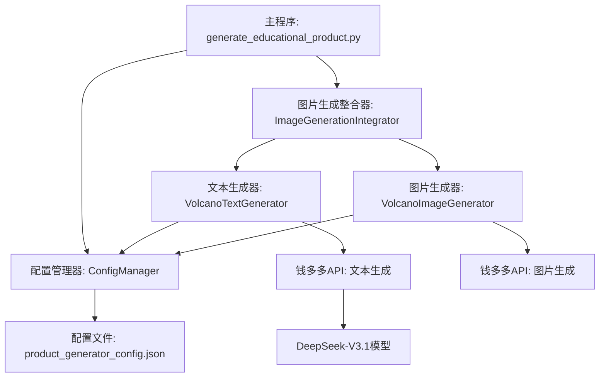
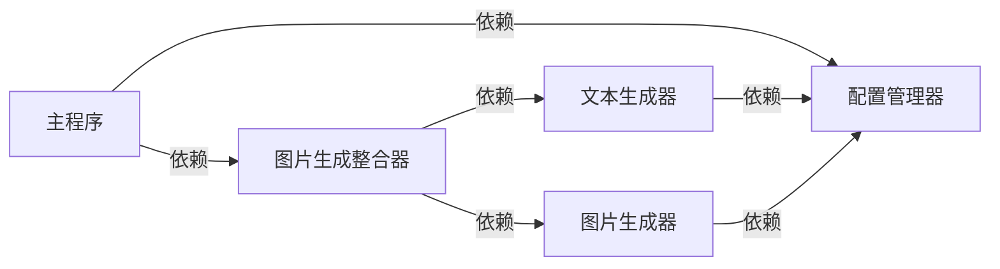
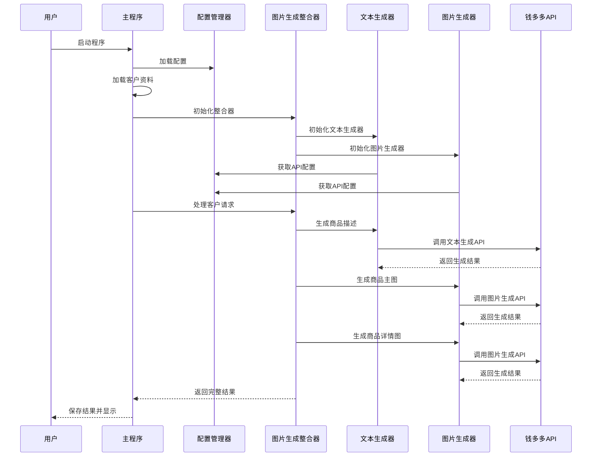

# 钱多多API配置 - 设计文档

## 整体架构图



## 分层设计和核心组件

### 1. 配置管理层

- **ConfigManager**：统一的配置管理组件，负责加载、验证和提供API配置
  - 功能：管理钱多多API配置、生成配置、上传配置等
  - 职责：确保所有模块使用一致的配置，支持配置文件和环境变量

### 2. API调用层

- **VolcanoTextGenerator**：文本生成器，使用钱多多API的DeepSeek-V3.1模型
  - 功能：文本生成、内容提取、商品描述生成
  - 职责：封装API调用逻辑，处理重试和错误

- **VolcanoImageGenerator**：图片生成器，使用钱多多API
  - 功能：生成商品主图和详情图
  - 职责：封装API调用逻辑，处理图片保存和管理

### 3. 业务逻辑层

- **ImageGenerationIntegrator**：图片生成整合器
  - 功能：协调文本生成和图片生成，处理客户请求
  - 职责：管理工作流程，提供统一的接口

### 4. 应用层

- **generate_educational_product.py**：主程序入口
  - 功能：解析命令行参数，加载配置和客户资料，启动生成流程
  - 职责：用户交互和任务编排

## 模块依赖关系图



## 接口契约定义

### 1. ConfigManager接口

```python
class ConfigManager:
    def __init__(self, config_file=None):
        # 初始化配置管理器，可选配置文件路径
        pass
    
    def load_config(self):
        # 加载配置文件
        pass
    
    def validate_config(self):
        # 验证配置有效性
        pass
    
    def get_qianduoduo_api_config(self):
        # 获取钱多多API配置
        pass
    
    def get_generation_config(self):
        # 获取生成配置
        pass
    
    def get_upload_config(self):
        # 获取上传配置
        pass
    
    def get_points_config(self):
        # 获取积分配置
        pass
```

### 2. VolcanoTextGenerator接口

```python
class VolcanoTextGenerator:
    def __init__(self, config_manager=None):
        # 初始化文本生成器，使用配置管理器
        pass
    
    def generate_text(self, prompt, max_tokens=1000, temperature=0.7):
        # 生成文本
        pass
    
    def extract_content_info(self, document_content):
        # 提取文档内容信息
        pass
```

### 3. VolcanoImageGenerator接口

```python
class VolcanoImageGenerator:
    def __init__(self, config=None):
        # 初始化图片生成器，使用配置
        pass
    
    def generate_image(self, prompt, image_count=1, size="1024x1024"):
        # 生成图片
        pass
    
    def generate_main_images(self, product_info, count=None):
        # 生成商品主图
        pass
    
    def generate_detail_images(self, product_info, count=None):
        # 生成商品详情图
        pass
```

### 4. ImageGenerationIntegrator接口

```python
class ImageGenerationIntegrator:
    def __init__(self, config_manager=None):
        # 初始化整合器，使用配置管理器
        pass
    
    def process_client_request(self, client_data, progress_callback=None):
        # 处理客户请求
        pass
    
    def generate_product_description(self, product_info):
        # 生成商品描述
        pass
```

## 数据流向图



## 异常处理策略

1. **配置异常**：
   - 配置文件不存在：使用默认配置
   - API密钥缺失：使用默认密钥并记录警告
   - 配置格式错误：抛出异常并显示详细错误信息

2. **API调用异常**：
   - 网络错误：实现重试机制（默认3次）
   - API限流：实现退避策略（指数退避）
   - 无效响应：解析失败时使用备用解析方法

3. **业务异常**：
   - 客户资料不完整：使用默认值或从文本中提取
   - 生成失败：记录错误并返回部分结果

4. **日志策略**：
   - 所有关键操作记录日志
   - 错误信息包含详细上下文
   - API调用成功/失败状态记录

## 配置文件结构

```json
{
  "generation": {  // 生成配置
    "main_images_count": 3,  // 主图数量
    "detail_images_count": 2,  // 详情图数量
    "image_size": "1024x1024",  // 图片尺寸
    "image_format": "jpg",  // 图片格式
    "max_retries": 3,  // 最大重试次数
    "timeout": 60  // 超时时间（秒）
  },
  "upload": {  // 上传配置
    "platform": "wechat",  // 上传平台
    "auto_upload": false,  // 是否自动上传
    "compress_images": true,  // 是否压缩图片
    "max_image_size_mb": 5  // 最大图片大小（MB）
  },
  "points": {  // 积分配置
    "cost_per_main_image": 10,  // 每张主图消耗积分
    "cost_per_detail_image": 8,  // 每张详情图消耗积分
    "cost_per_text_generation": 5  // 每次文本生成消耗积分
  },
  "qianduoduo_api": {  // 钱多多API配置
    "api_key": "sk-T3PbJoofAo22v5CzDhrFUhlVuX3MmPdUTRTswa7phYdZ6Q5g",  // API密钥
    "api_base_url": "https://api2.aigcbest.top",  // API基础URL
    "model_name": "DeepSeek-V3.1",  // 模型名称
    "text_generation_endpoint": "/v1/chat/completions",  // 文本生成端点
    "image_generation_endpoint": "/v1/images/generations",  // 图片生成端点
    "timeout": 60,  // 超时时间
    "retry_count": 3,  // 重试次数
    "retry_delay": 3,  // 重试延迟（秒）
    "main_images_count": 3,  // 主图数量
    "detail_images_count": 2,  // 详情图数量
    "image_save_dir": "./temp_images"  // 图片保存目录
  }
}```