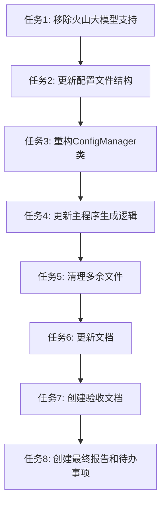

# 钱多多API配置 - 任务拆分文档

## 任务列表

### 任务1: 移除火山大模型支持相关代码

- **输入契约**：
  - 前置依赖：项目代码库
  - 输入数据：volcano_text_generator.py, volcano_image_generator.py, config_manager.py
  - 环境依赖：Python开发环境

- **输出契约**：
  - 输出数据：更新后的Python文件，移除所有火山大模型相关引用
  - 交付物：代码变更
  - 验收标准：代码中不再包含火山大模型相关逻辑，所有API调用统一使用钱多多API

- **实现约束**：
  - 技术栈：Python
  - 接口规范：保持原有类名和方法签名不变，仅修改内部实现
  - 质量要求：确保代码可运行，无语法错误

- **依赖关系**：
  - 后置任务：更新配置文件结构
  - 并行任务：无

### 任务2: 更新配置文件结构

- **输入契约**：
  - 前置依赖：任务1完成
  - 输入数据：product_generator_config.json
  - 环境依赖：文本编辑器

- **输出契约**：
  - 输出数据：更新后的配置文件，移除volcano_api部分，添加qianduoduo_api部分
  - 交付物：配置文件变更
  - 验收标准：配置文件包含钱多多API所需的所有字段，且结构正确

- **实现约束**：
  - 技术栈：JSON
  - 接口规范：遵循设计文档中的配置结构
  - 质量要求：配置文件格式正确，可被程序读取

- **依赖关系**：
  - 后置任务：重构ConfigManager类
  - 并行任务：无

### 任务3: 重构ConfigManager类

- **输入契约**：
  - 前置依赖：任务2完成
  - 输入数据：config_manager.py
  - 环境依赖：Python开发环境

- **输出契约**：
  - 输出数据：更新后的ConfigManager类，移除火山API相关方法，添加钱多多API配置管理方法
  - 交付物：代码变更
  - 验收标准：ConfigManager能够正确加载和提供钱多多API配置

- **实现约束**：
  - 技术栈：Python
  - 接口规范：保持原有公共方法签名，更新内部实现
  - 质量要求：配置验证逻辑完整，错误处理完善

- **依赖关系**：
  - 后置任务：更新主程序生成逻辑
  - 并行任务：无

### 任务4: 更新主程序生成逻辑

- **输入契约**：
  - 前置依赖：任务3完成
  - 输入数据：generate_educational_product.py
  - 环境依赖：Python开发环境

- **输出契约**：
  - 输出数据：更新后的主程序，确保使用钱多多API
  - 交付物：代码变更
  - 验收标准：主程序能够使用钱多多API生成内容

- **实现约束**：
  - 技术栈：Python
  - 接口规范：保持原有命令行参数和功能
  - 质量要求：程序运行正常，能够生成预期输出

- **依赖关系**：
  - 后置任务：清理多余文件
  - 并行任务：无

### 任务5: 清理多余文件

- **输入契约**：
  - 前置依赖：任务1-4完成
  - 输入数据：项目目录中的多余文件
  - 环境依赖：文件系统

- **输出契约**：
  - 输出数据：清理后的项目目录
  - 交付物：删除不需要的测试和工具文件
  - 验收标准：项目目录只包含核心功能文件

- **实现约束**：
  - 技术栈：文件操作
  - 接口规范：保留所有必要的源文件和配置文件
  - 质量要求：不删除重要文件

- **依赖关系**：
  - 后置任务：更新文档
  - 并行任务：无

### 任务6: 更新文档

- **输入契约**：
  - 前置依赖：任务1-5完成
  - 输入数据：项目文档
  - 环境依赖：文本编辑器

- **输出契约**：
  - 输出数据：更新后的文档，包含钱多多API配置和使用说明
  - 交付物：文档变更
  - 验收标准：文档内容准确反映当前项目状态

- **实现约束**：
  - 技术栈：Markdown
  - 接口规范：遵循项目文档格式
  - 质量要求：文档清晰易懂，包含所有必要信息

- **依赖关系**：
  - 后置任务：创建验收文档
  - 并行任务：无

### 任务7: 创建验收文档

- **输入契约**：
  - 前置依赖：任务6完成
  - 输入数据：所有完成的任务
  - 环境依赖：文本编辑器

- **输出契约**：
  - 输出数据：验收文档，记录任务完成情况
  - 交付物：ACCEPTANCE文档
  - 验收标准：文档包含所有任务的完成状态和验证结果

- **实现约束**：
  - 技术栈：Markdown
  - 接口规范：遵循项目文档格式
  - 质量要求：文档准确记录项目状态

- **依赖关系**：
  - 后置任务：创建最终报告和待办事项
  - 并行任务：无

### 任务8: 创建最终报告和待办事项

- **输入契约**：
  - 前置依赖：任务7完成
  - 输入数据：项目完成情况
  - 环境依赖：文本编辑器

- **输出契约**：
  - 输出数据：最终报告和待办事项文档
  - 交付物：FINAL和TODO文档
  - 验收标准：文档全面总结项目成果和剩余工作

- **实现约束**：
  - 技术栈：Markdown
  - 接口规范：遵循项目文档格式
  - 质量要求：文档清晰明确

- **依赖关系**：
  - 后置任务：无
  - 并行任务：无

## 任务依赖图

## 任务执行顺序

1. 任务1: 移除火山大模型支持相关代码
2. 任务2: 更新配置文件结构
3. 任务3: 重构ConfigManager类
4. 任务4: 更新主程序生成逻辑
5. 任务5: 清理多余文件
6. 任务6: 更新文档
7. 任务7: 创建验收文档
8. 任务8: 创建最终报告和待办事项

## 风险评估

- **配置不兼容风险**：新旧配置文件结构不同可能导致程序无法正常加载配置
  - 缓解措施：在ConfigManager中添加向后兼容逻辑，提供默认配置

- **API调用失败风险**：钱多多API调用失败可能影响程序功能
  - 缓解措施：完善异常处理和重试机制

- **功能丢失风险**：移除火山API支持可能导致某些功能不可用
  - 缓解措施：确保钱多多API实现所有必要功能，进行充分测试