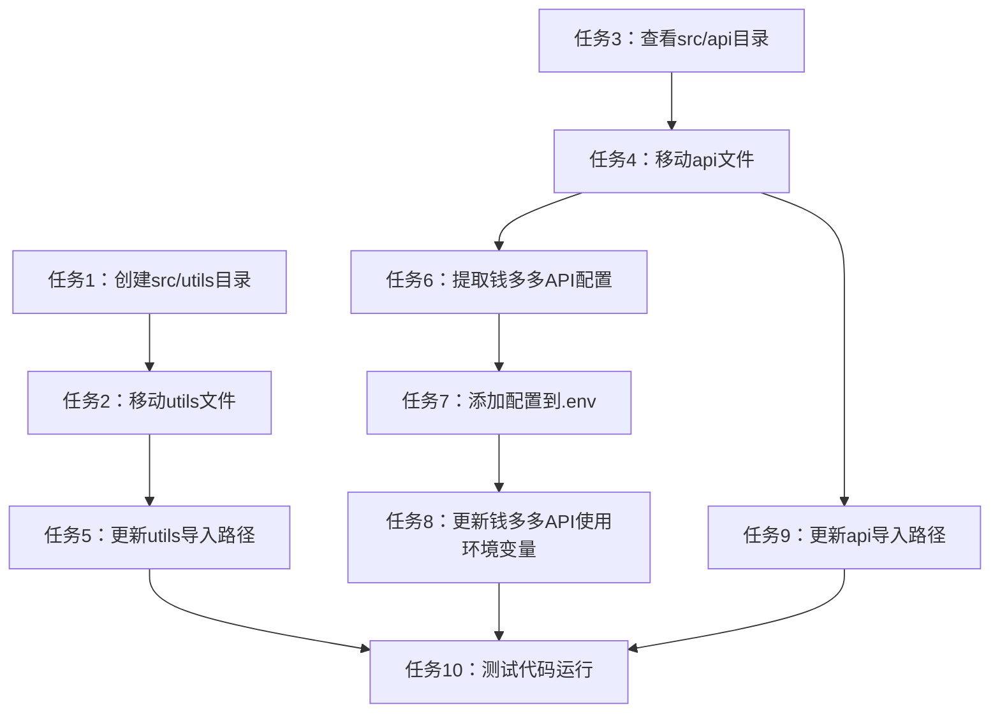

# 目录结构调整任务拆分文档

## 任务概述

本次任务旨在调整项目的目录结构，将utils目录和api目录（包含钱多多API）移动到src目录下，并将钱多多API的相关配置迁移到.env文件，同时更新所有相关文件的导入路径，确保代码可以正常运行。

## 原子任务拆分

### 任务1：创建src/utils目录

**输入契约**：
- src目录已存在
- PowerShell环境可用

**输出契约**：
- 创建`src/utils`目录

**实现约束**：
- 使用Windows PowerShell命令
- 确保目录创建成功

**依赖关系**：
- 无前置任务
- 是任务2的前提

### 任务2：移动utils目录下的文件到src/utils

**输入契约**：
- src/utils目录已创建（任务1完成）
- 根目录下存在utils目录

**输出契约**：
- 将utils/exceptions.py -> src/utils/
- 将utils/logger.py -> src/utils/
- 将utils/standardized_interface.py -> src/utils/

**实现约束**：
- 使用Move-Item命令
- 保留文件内容不变

**依赖关系**：
- 前置任务：任务1
- 后置任务：任务5

### 任务3：查看src/api目录内容

**输入契约**：
- src/api目录已存在

**输出契约**：
- 了解src/api目录下已有的文件

**实现约束**：
- 使用ls命令查看目录内容

**依赖关系**：
- 无前置任务
- 是任务4的前提

### 任务4：移动根目录api目录下的文件到src/api

**输入契约**：
- 了解src/api目录下已有文件（任务3完成）
- 根目录下存在api目录

**输出契约**：
- 将api/qianduoduo_api.py -> src/api/
- 处理可能的文件冲突

**实现约束**：
- 使用Move-Item命令
- 保留文件内容不变
- 注意处理可能的文件覆盖

**依赖关系**：
- 前置任务：任务3
- 后置任务：任务6

### 任务5：更新导入utils模块的路径

**输入契约**：
- utils文件已移动到src/utils（任务2完成）
- 相关Python文件存在

**输出契约**：
- 更新src/config/config_manager.py中的utils导入路径
- 更新src/core/main.py中的utils导入路径
- 更新src/core/product_generator.py中的utils导入路径
- 更新src/core/product_uploader.py中的utils导入路径
- 更新src/api/wechat_shop_api.py中的utils导入路径

**实现约束**：
- 保持原有功能不变
- 正确使用相对导入语法

**依赖关系**：
- 前置任务：任务2

### 任务6：查看钱多多API文件，提取配置信息

**输入契约**：
- qianduoduo_api.py已移动到src/api（任务4完成）

**输出契约**：
- 识别钱多多API的配置信息

**实现约束**：
- 查看文件内容
- 识别API密钥、端点等配置

**依赖关系**：
- 前置任务：任务4
- 后置任务：任务7

### 任务7：将钱多多API配置添加到.env文件

**输入契约**：
- 已提取钱多多API配置信息（任务6完成）
- .env文件存在

**输出契约**：
- 在.env文件中添加钱多多API配置

**实现约束**：
- 使用标准的环境变量格式
- 添加适当的注释

**依赖关系**：
- 前置任务：任务6
- 后置任务：任务8

### 任务8：更新钱多多API文件，使用环境变量

**输入契约**：
- 已在.env文件中添加钱多多API配置（任务7完成）
- src/api/qianduoduo_api.py文件存在

**输出契约**：
- 更新qianduoduo_api.py，使用os.environ获取配置
- 添加dotenv.load_dotenv()调用

**实现约束**：
- 保持原有功能不变
- 正确使用环境变量

**依赖关系**：
- 前置任务：任务7

### 任务9：更新导入api模块的路径

**输入契约**：
- api文件已移动到src/api（任务4完成）
- 相关Python文件存在

**输出契约**：
- 更新src/core/main.py中的api导入路径
- 更新src/core/product_generator.py中的api导入路径（如果有）

**实现约束**：
- 保持原有功能不变
- 正确使用相对导入语法

**依赖关系**：
- 前置任务：任务4

### 任务10：测试代码运行

**输入契约**：
- 所有文件移动完成
- 所有导入路径已更新
- 配置已迁移到.env文件

**输出契约**：
- 验证代码可以正常运行

**实现约束**：
- 运行主程序
- 检查是否有错误

**依赖关系**：
- 前置任务：任务5、任务8、任务9

## 任务依赖图

## 验收标准

1. utils目录成功移动到src目录下
2. api目录内容成功移动到src/api目录下
3. 钱多多API配置成功添加到.env文件
4. 所有Python文件的导入路径已更新
5. 代码可以正常运行，无错误