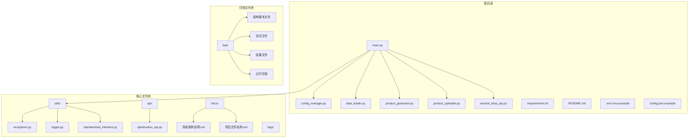
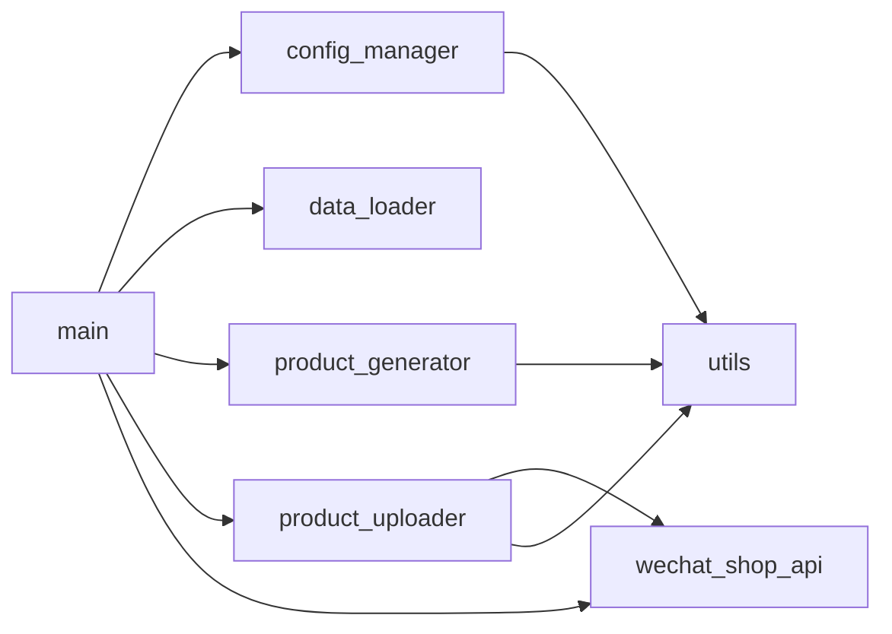

# 项目文件整理设计文档

## 整体架构图

## 分层设计和核心组件
1. **核心执行层**：
   - main.py：系统入口点，协调各组件工作
   - config_manager.py：配置管理
   - data_loader.py：数据加载
   - product_generator.py：商品生成
   - product_uploader.py：商品上传
   - wechat_shop_api.py：微信小店API封装

2. **工具层**：
   - utils/exceptions.py：异常类定义
   - utils/logger.py：日志工具
   - utils/standardized_interface.py：标准化接口

3. **API层**：
   - api/qianduoduo_api.py：钱多多API接口

4. **文档层**：
   - docs/系统架构说明.md：系统架构描述
   - docs/项目文件结构.md：文件组织说明

5. **归档层**：
   - bak/：存放所有非核心文件

## 模块依赖关系图

## 接口契约定义
无需接口变更，仅调整文件组织结构。

## 数据流向图
无需数据流向变更，仅调整文件组织结构。

## 异常处理策略
- 所有文件移动操作使用安全的方式，避免覆盖已有文件
- 在移动前进行目标文件夹检查，确保存在
- 记录所有移动操作，便于追踪和恢复