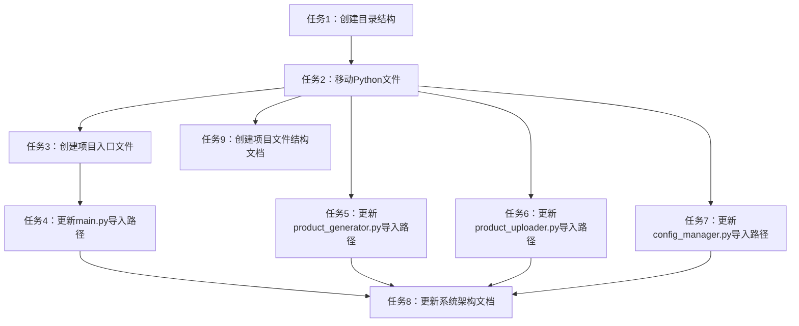

# 文件整理任务拆分文档

## 任务概述

本次任务旨在将项目根目录下的Python文件按照功能模块进行分类整理，提高项目的可维护性和可读性。

## 原子任务拆分

### 任务1：创建目录结构

**输入契约**：
- 项目根目录已存在
- PowerShell环境可用

**输出契约**：
- 创建`src`主目录
- 创建`src/config`、`src/data`、`src/core`、`src/api`子目录

**实现约束**：
- 使用Windows PowerShell命令
- 确保目录结构符合Python项目最佳实践

**依赖关系**：
- 无前置任务
- 是后续任务的前提

### 任务2：移动Python文件到对应目录

**输入契约**：
- 目录结构已创建完成（任务1完成）
- 根目录下存在Python文件

**输出契约**：
- config_manager.py -> src/config/
- data_loader.py -> src/data/
- main.py, product_generator.py, product_uploader.py -> src/core/
- wechat_shop_api.py -> src/api/

**实现约束**：
- 使用Move-Item命令
- 保留文件内容不变

**依赖关系**：
- 前置任务：任务1
- 后置任务：任务3

### 任务3：创建项目入口文件

**输入契约**：
- 核心文件已移动到src/core目录（任务2完成）

**输出契约**：
- 在根目录创建新的main.py文件，作为项目入口

**实现约束**：
- 设置Python路径，确保能正确导入src目录下的模块
- 调用src/core/main.py中的main函数

**依赖关系**：
- 前置任务：任务2
- 后置任务：任务4

### 任务4：更新src/core/main.py导入路径

**输入契约**：
- src/core/main.py文件存在
- 目录结构已创建且文件已移动（任务1、2完成）

**输出契约**：
- 更新Python路径设置
- 更新导入语句，使用新的相对路径

**实现约束**：
- 保持原有功能不变
- 正确使用相对导入语法

**依赖关系**：
- 前置任务：任务2、任务3
- 后置任务：任务5、任务6

### 任务5：更新src/core/product_generator.py导入路径

**输入契约**：
- src/core/product_generator.py文件存在
- 数据加载模块已移动到src/data目录（任务2完成）

**输出契约**：
- 更新data_loader模块的导入路径

**实现约束**：
- 保持原有功能不变

**依赖关系**：
- 前置任务：任务2

### 任务6：更新src/core/product_uploader.py导入路径

**输入契约**：
- src/core/product_uploader.py文件存在
- 配置模块已移动到src/config目录
- API模块已移动到src/api目录

**输出契约**：
- 更新config_manager和wechat_shop_api模块的导入路径

**实现约束**：
- 保持原有功能不变

**依赖关系**：
- 前置任务：任务2

### 任务7：更新src/config/config_manager.py导入路径

**输入契约**：
- src/config/config_manager.py文件存在
- utils模块位于项目根目录

**输出契约**：
- 添加正确的Python路径设置
- 确保能正确导入utils模块

**实现约束**：
- 保持原有功能不变

**依赖关系**：
- 前置任务：任务2

### 任务8：更新系统架构文档

**输入契约**：
- 所有文件已整理完成
- 所有导入路径已更新

**输出契约**：
- 更新docs/系统架构说明.md，反映新的文件结构

**实现约束**：
- 更新架构图
- 更新模块说明
- 反映新的依赖关系

**依赖关系**：
- 前置任务：任务4、任务5、任务6、任务7

### 任务9：创建项目文件结构文档

**输入契约**：
- 目录结构已创建
- 文件已整理完成

**输出契约**：
- 创建docs/项目文件结构.md，详细说明新的文件结构

**实现约束**：
- 包含完整的文件列表
- 说明各文件的作用
- 展示模块依赖关系

**依赖关系**：
- 前置任务：任务2

## 任务依赖图

## 验收标准

1. 所有Python文件按照功能正确分类到对应目录
2. 所有导入路径已更新，确保代码可以正常运行
3. 架构文档和文件结构文档已更新，准确反映新的项目结构
4. 执行项目入口文件，确保功能正常