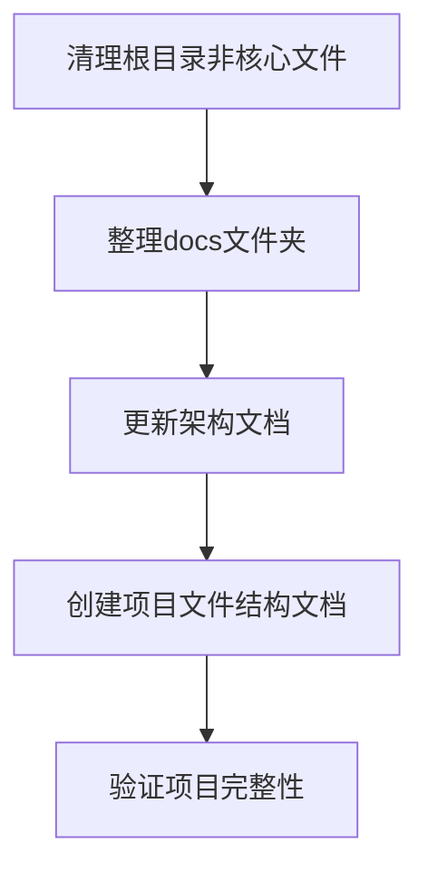

# 项目文件整理任务分解

## 任务依赖图

## 任务1：清理根目录非核心文件

### 输入契约
- 当前项目文件结构

### 输出契约
- 精简后的根目录，仅保留核心文件
- 所有非核心文件移至bak目录

### 实现约束
- 保留的文件：main.py, config_manager.py, data_loader.py, product_generator.py, product_uploader.py, wechat_shop_api.py, requirements.txt, README.md, .env, .env.example, config.json.example
- 保留的文件夹：utils/, api/, docs/, logs/, bak/
- 其他文件移至bak目录

### 依赖关系
- 无前置依赖
- 后置任务：task2

## 任务2：整理docs文件夹

### 输入契约
- 当前docs文件夹内容

### 输出契约
- 清理后的docs文件夹，仅保留核心文档
- 过时文档移至bak目录

### 实现约束
- 保留项目文件整理相关文档
- 创建新的核心架构文档
- 移除其他任务文档

### 依赖关系
- 前置任务：task1
- 后置任务：task3

## 任务3：更新架构文档

### 输入契约
- 精简后的项目文件结构
- 当前系统架构说明.md

### 输出契约
- 更新后的系统架构说明.md

### 实现约束
- 反映当前的文件结构
- 包含最新的模块依赖关系
- 使用mermaid绘制架构图

### 依赖关系
- 前置任务：task2
- 后置任务：task4

## 任务4：创建项目文件结构文档

### 输入契约
- 精简后的项目文件结构

### 输出契约
- 项目文件结构.md

### 实现约束
- 详细说明项目文件组织
- 描述各文件和文件夹的作用
- 包含文件结构图表

### 依赖关系
- 前置任务：task3
- 后置任务：task5

## 任务5：验证项目完整性

### 输入契约
- 整理后的项目结构

### 输出契约
- 验证报告

### 实现约束
- 检查项目文件是否完整
- 确保main.py及其依赖文件存在
- 运行简单命令验证项目可执行性

### 依赖关系
- 前置任务：task4
- 无后置任务