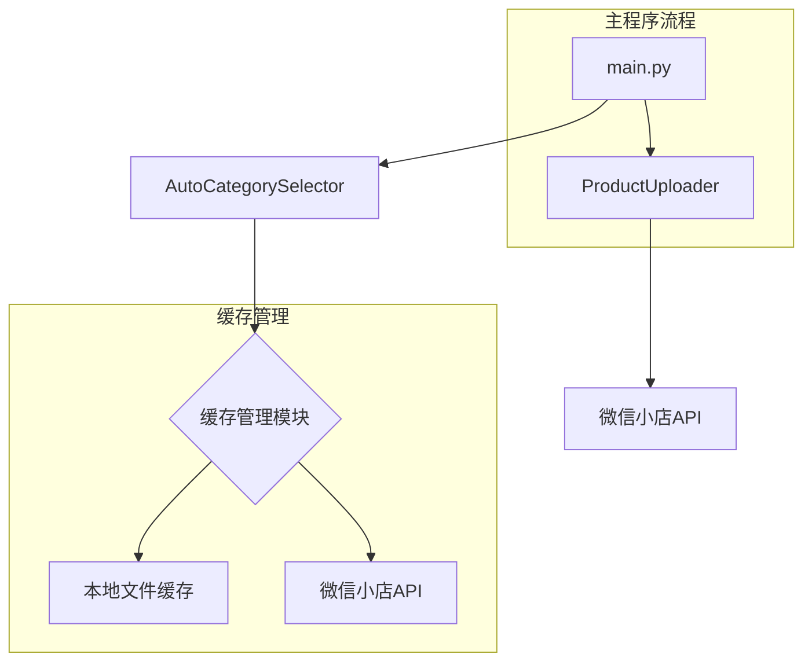
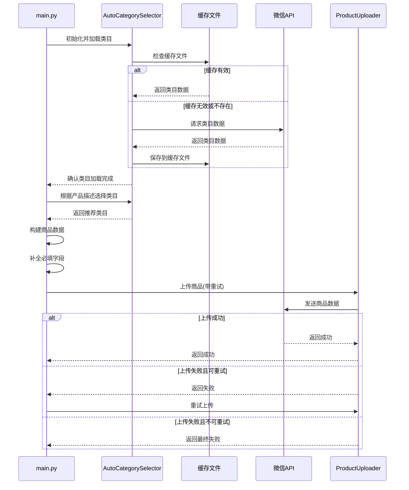

# 类目缓存优化设计文档

## 整体架构图



## 分层设计

### 1. 数据访问层
- **缓存管理模块**：负责类目数据的本地缓存存取
- **API访问模块**：负责与微信小店API交互

### 2. 业务逻辑层
- **AutoCategorySelector**：自动类目选择器，整合缓存和API访问
- **ProductUploader**：商品上传器，处理商品数据上传

### 3. 应用层
- **main.py**：主程序入口，协调各模块工作

## 核心组件设计

### 1. AutoCategorySelector 增强设计

#### 新增属性
- `categories_file`：缓存文件路径
- `cache_expiry_hours`：缓存过期时间（小时）
- `last_update_time`：最后更新时间

#### 核心方法

```python
# 从文件加载类目数据
def load_categories_from_file(self):
    # 检查文件是否存在
    # 读取JSON数据
    # 验证数据有效性和过期时间
    # 返回类目数据或None
    pass

# 增强的类目加载方法
def load_categories(self, force_refresh=False):
    # 如果force_refresh为False，尝试从文件加载
    # 如果文件加载失败或过期，从API获取
    # 获取成功后保存到文件
    # 返回类目数据
    pass

# 检查缓存是否有效
def is_cache_valid(self, cache_data):
    # 检查时间戳
    # 验证数据完整性
    # 返回布尔值
    pass

# 统一的类目选择接口
def select_categories(self, product_text):
    # 确保类目数据已加载
    # 调用现有的匹配逻辑
    # 返回推荐类目
    pass
```

### 2. main.py 优化设计

#### 预初始化优化
```python
# 在程序开始时预初始化自动类目选择器
category_selector = AutoCategorySelector(api_client)
try:
    category_selector.load_categories()
    print("类目数据加载完成")
except Exception as e:
    print(f"预加载类目数据失败，但程序可以继续运行: {e}")
```

#### get_valid_category_id 函数优化
```python
def get_valid_category_id(product_text):
    # 优先使用自动类目选择器（从缓存或API）
    try:
        category_info = category_selector.select_categories(product_text)
        if category_info:
            return build_category_data(category_info)
    except Exception as e:
        print(f"自动类目选择失败: {e}")
    
    # 备选方案：API调用
    # 备选方案：默认类目
    pass
```

#### 商品上传重试机制
```python
def upload_with_retry(uploader, product_data, max_retries=3):
    retries = 0
    while retries < max_retries:
        try:
            result = uploader.upload(product_data)
            if result['success']:
                return result
            elif '网络错误' in result.get('error', ''):
                retries += 1
                wait_time = 2 ** retries  # 指数退避
                print(f"上传失败，{wait_time}秒后重试 ({retries}/{max_retries})...")
                time.sleep(wait_time)
            else:
                # 非网络错误，直接返回
                return result
        except Exception as e:
            retries += 1
            wait_time = 2 ** retries
            print(f"上传异常: {e}，{wait_time}秒后重试 ({retries}/{max_retries})...")
            time.sleep(wait_time)
    return {'success': False, 'error': '达到最大重试次数'}
```

#### 必填字段自动补全
```python
def complete_required_fields(product_data):
    # 确保title存在
    if not product_data.get('title'):
        product_data['title'] = '未命名商品'
    
    # 确保desc存在
    if not product_data.get('desc'):
        product_data['desc'] = '暂无描述'
    
    # 确保price存在且为数字
    if not product_data.get('price'):
        product_data['price'] = 0
    
    # 确保sku_info存在
    if not product_data.get('sku_info'):
        product_data['sku_info'] = [{"sku_id": "1", "price": product_data['price'], "stock": 999}]
    
    return product_data
```

## 数据流向图



## 异常处理策略

### 1. 缓存相关异常
- **缓存文件不存在**：从API获取并创建
- **缓存数据格式错误**：删除无效缓存，从API重新获取
- **缓存过期**：从API更新缓存

### 2. API调用异常
- **网络错误**：实现重试机制
- **API限流**：延迟重试
- **认证失败**：提示重新配置凭证

### 3. 商品上传异常
- **必填字段缺失**：自动补全
- **格式错误**：提供详细错误信息并尝试修正
- **业务错误**：根据错误码提供解决方案建议

## 接口契约定义

### 1. AutoCategorySelector 公共接口
```python
class AutoCategorySelector:
    def __init__(self, api_client, categories_file=None, cache_expiry_hours=24):
        # 初始化参数
        pass
    
    def load_categories(self, force_refresh=False):
        # 加载类目数据
        # 返回：类目数据字典
        pass
    
    def select_categories(self, product_text):
        # 根据产品描述选择类目
        # 返回：推荐类目信息字典
        pass
    
    def save_categories_to_file(self):
        # 手动保存类目数据到文件
        # 返回：是否成功
        pass
```

### 2. main.py 主要函数
```python
def get_valid_category_id(product_text):
    # 获取有效的类目ID
    # 返回：完整的类目信息字典
    pass

def build_product_data(product_text, category_info):
    # 构建商品数据
    # 返回：完整的商品数据字典
    pass

def main():
    # 主函数入口
    pass
```

## 实现优先级

1. 缓存目录创建和基础文件操作函数
2. AutoCategorySelector的缓存加载和保存功能
3. main.py中的预初始化和优化调用
4. 商品上传重试机制
5. 必填字段自动补全功能
6. 全面的错误处理和日志记录