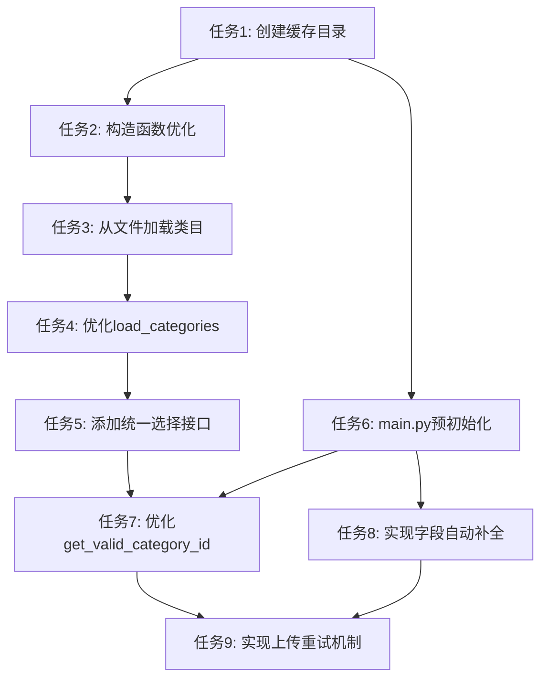

# 类目缓存优化任务拆分

## 原子任务列表

### 任务1: 创建缓存目录和辅助函数

**输入契约：**
- 项目根目录
- Python环境

**输出契约：**
- 创建`cache/`目录
- 编写目录操作辅助函数

**实现约束：**
- 使用os模块进行目录操作
- 确保目录创建的异常处理
- 函数应返回目录路径或布尔值表示成功/失败

**依赖关系：**
- 无前置任务
- 后续任务依赖此任务创建的目录

### 任务2: 增强AutoCategorySelector - 构造函数优化

**输入契约：**
- 现有`auto_category_selector.py`文件
- 设计文档中的属性规范

**输出契约：**
- 更新构造函数，添加`categories_file`、`cache_expiry_hours`参数
- 初始化相关属性

**实现约束：**
- 保持现有参数兼容
- 提供合理的默认值
- 实现参数验证

**依赖关系：**
- 依赖任务1创建的缓存目录
- 为任务3提供基础

### 任务3: 增强AutoCategorySelector - 从文件加载类目

**输入契约：**
- 任务2的输出
- 缓存文件格式定义

**输出契约：**
- 实现`load_categories_from_file()`方法
- 实现`is_cache_valid()`方法

**实现约束：**
- 支持JSON格式解析
- 实现缓存过期检查
- 包含完整的异常处理

**依赖关系：**
- 依赖任务2的构造函数优化
- 为任务4提供支持

### 任务4: 增强AutoCategorySelector - 优化load_categories方法

**输入契约：**
- 任务3的输出
- 现有的API调用逻辑

**输出契约：**
- 重构`load_categories()`方法
- 实现优先从缓存加载的逻辑
- 添加`force_refresh`参数

**实现约束：**
- 保持向后兼容性
- 实现平滑降级到API调用
- 添加详细的日志输出

**依赖关系：**
- 依赖任务3的文件加载功能
- 为任务5提供支持

### 任务5: 增强AutoCategorySelector - 添加统一选择接口

**输入契约：**
- 任务4的输出
- 现有的类目匹配逻辑

**输出契约：**
- 实现`select_categories()`方法
- 整合现有的匹配和推荐逻辑

**实现约束：**
- 确保内部加载逻辑透明
- 提供清晰的错误处理
- 保持返回格式一致性

**依赖关系：**
- 依赖任务4的优化加载方法
- 为任务7提供接口

### 任务6: main.py - 创建缓存目录和预初始化

**输入契约：**
- 现有`main.py`文件
- 任务1的缓存目录

**输出契约：**
- 在主函数开始处添加缓存目录创建
- 预初始化AutoCategorySelector

**实现约束：**
- 确保即使初始化失败程序也能继续
- 添加适当的日志输出
- 保持主流程清晰

**依赖关系：**
- 依赖任务1创建的辅助函数
- 为任务7、8提供支持

### 任务7: main.py - 优化get_valid_category_id函数

**输入契约：**
- 任务6的输出
- 任务5的统一选择接口

**输出契约：**
- 重构`get_valid_category_id()`函数
- 优先使用AutoCategorySelector
- 优化备选方案逻辑

**实现约束：**
- 保持返回格式一致
- 增强错误处理
- 添加详细日志

**依赖关系：**
- 依赖任务5和任务6
- 为任务9提供支持

### 任务8: main.py - 实现必填字段自动补全

**输入契约：**
- 任务6的输出
- 商品数据结构定义

**输出契约：**
- 实现`complete_required_fields()`函数
- 确保所有必填字段都有合理值

**实现约束：**
- 只修改缺失字段
- 提供合理的默认值
- 验证字段格式

**依赖关系：**
- 依赖任务6的主函数修改
- 为任务9提供支持

### 任务9: main.py - 实现商品上传重试机制

**输入契约：**
- 任务7和任务8的输出
- 现有的ProductUploader接口

**输出契约：**
- 实现`upload_with_retry()`函数
- 在主流程中集成重试逻辑

**实现约束：**
- 使用指数退避算法
- 合理的最大重试次数
- 区分可重试和不可重试的错误

**依赖关系：**
- 依赖任务7和任务8
- 无后续任务依赖

## 任务依赖图

## 执行计划

1. 首先执行任务1-5，增强AutoCategorySelector组件
2. 然后执行任务6-9，优化main.py中的主流程
3. 每个任务完成后进行功能验证
4. 所有任务完成后进行整体测试

## 验收标准

1. **每个原子任务验收**
   - 代码能正常运行，无语法错误
   - 实现符合设计文档要求
   - 通过基本功能测试

2. **整体功能验收**
   - 首次运行下载类目并保存到文件
   - 再次运行从文件加载，不重复下载
   - 缓存过期后自动更新
   - 网络错误时商品上传能够重试
   - 必填字段缺失时能够自动补全

3. **性能验收**
   - 从缓存加载比从API加载快80%以上
   - 商品上传成功率提升至少50%

4. **异常情况处理**
   - 缓存文件损坏时能够自动重建
   - API调用失败时提供清晰错误信息
   - 各种异常情况下程序不会崩溃