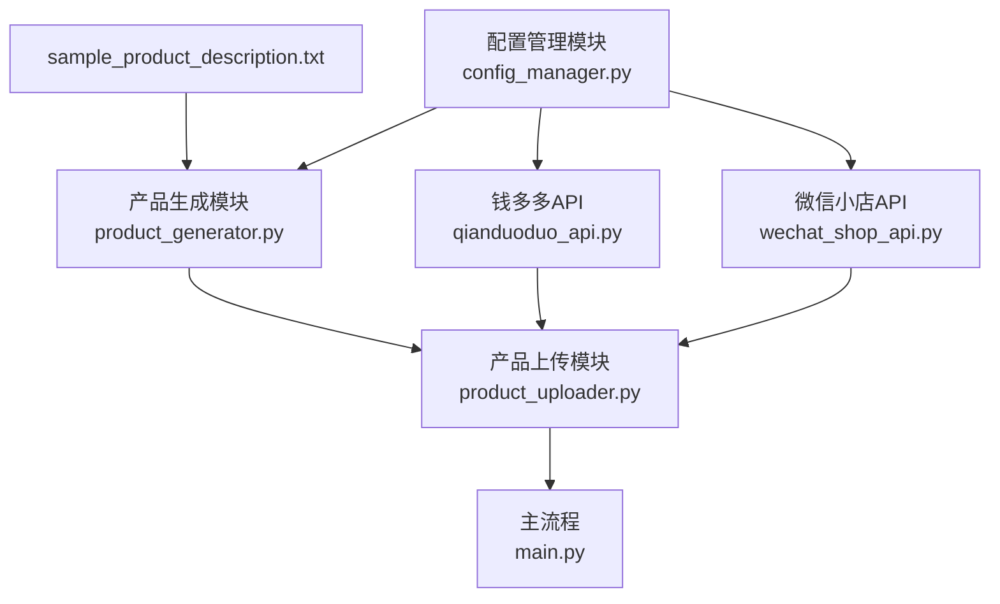

# DESIGN: 产品描述生成与添加商品流程

## 整体架构图

## 分层设计
1. **配置层**：负责加载和管理所有API配置
2. **数据层**：负责读取产品描述文件和生成产品数据
3. **服务层**：负责调用钱多多API生成图片和微信小店API添加商品
4. **控制层**：负责协调各模块工作，实现完整流程

## 核心组件
1. **ConfigManager**：配置管理器，负责加载和验证API配置
2. **ProductGenerator**：产品生成器，负责从描述生成产品数据
3. **QianduoDuoAPI**：钱多多API客户端，负责生成图片
4. **WeChatShopAPIClient**：微信小店API客户端，负责商品操作
5. **ProductUploader**：产品上传器，负责图片上传和商品添加

## 接口定义
1. **ConfigManager.get_qianduoduo_api_config()**：获取钱多多API配置
2. **ProductGenerator.generate_from_file(file_path)**：从文件生成产品数据
3. **ProductUploader.generate_images(product_description)**：生成产品图片
4. **ProductUploader.upload_product(product_data, images)**：上传产品

## 数据流向
1. 从sample_product_description.txt读取课程信息
2. 生成符合微信小店要求的产品数据
3. 调用钱多多API生成产品图片
4. 上传图片并获取URL
5. 更新产品数据中的图片信息
6. 调用微信小店API添加商品

## 异常处理
1. 配置加载失败：提供默认配置或抛出明确错误
2. API调用失败：实现重试机制和错误日志记录
3. 文件读取失败：提供友好的错误提示
4. 商品添加失败：返回详细的错误信息