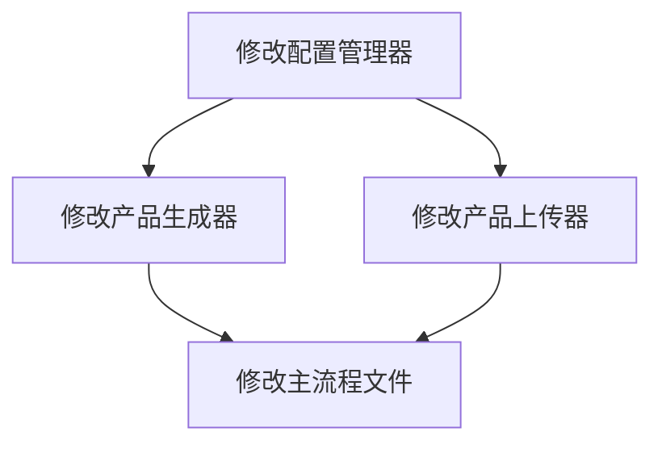

# TASK: 产品描述生成与添加商品流程

## 任务依赖图

## 子任务1: 修改配置管理器
### 输入契约
- 现有的config_manager.py文件
- .env文件中的API配置

### 输出契约
- 更新后的config_manager.py，确保正确加载钱多多API配置

### 实现约束
- 确保使用.env文件管理API密钥
- 提供默认配置作为备用

## 子任务2: 修改产品生成器
### 输入契约
- 现有的product_generator.py文件
- sample_product_description.txt文件

### 输出契约
- 更新后的product_generator.py，支持从文件读取并生成产品数据

### 实现约束
- 生成的数据必须符合微信小店要求的格式
- 支持教育培训类商品的数据结构

## 子任务3: 修改产品上传器
### 输入契约
- 现有的product_uploader.py文件
- 钱多多API和微信小店API客户端

### 输出契约
- 更新后的product_uploader.py，实现图片生成和商品上传功能

### 实现约束
- 使用钱多多API生成图片
- 确保图片上传到微信小店并更新产品数据

## 子任务4: 修改主流程文件
### 输入契约
- 现有的main.py文件
- 更新后的配置管理器、产品生成器和产品上传器

### 输出契约
- 更新后的main.py，实现完整的产品生成和上传流程

### 实现约束
- 流程清晰，错误处理完善
- 提供详细的日志输出