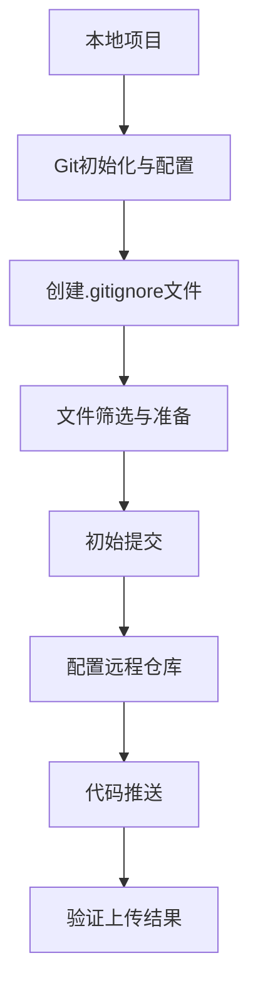
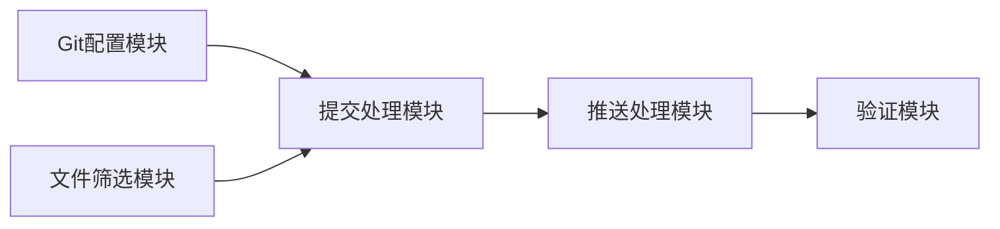
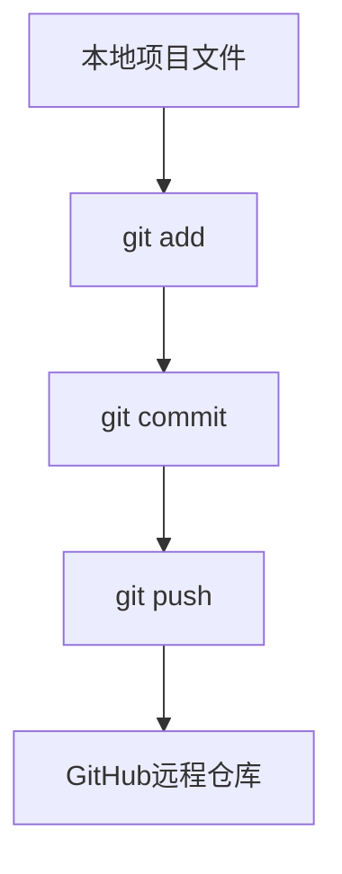

# GitHub项目上传设计文档

## 1. 整体架构图

## 2. 核心组件和流程

### 2.1 Git环境配置
- 初始化Git仓库
- 配置用户信息（用户名和邮箱）
- 配置远程仓库地址

### 2.2 文件筛选机制
- 通过.gitignore文件定义排除规则
- 确保敏感信息不被提交
- 保留必要的项目文件

### 2.3 代码提交流程
- 添加所有必要文件到暂存区
- 创建初始提交
- 推送到远程仓库

## 3. 模块依赖关系图

## 4. 接口定义

此任务不涉及API接口定义，主要是Git命令行操作流程。

## 5. 数据流向图

## 6. 异常处理策略

### 6.1 常见异常及处理方法
- **Git初始化失败**：检查是否已有.git目录，若有则移除后重新初始化
- **远程仓库连接失败**：检查网络连接和仓库地址是否正确
- **文件冲突**：解决冲突后重新提交
- **权限不足**：检查GitHub账户权限和认证状态

### 6.2 回滚机制
- 若推送失败，保留本地提交记录，修复问题后再次推送
- 必要时可以使用git reset命令撤销本地提交