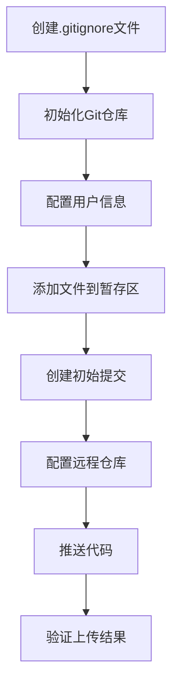

# GitHub项目上传任务拆分文档

## 1. 任务依赖图

## 2. 子任务详细说明

### 2.1 创建.gitignore文件

**输入契约：**
- 项目目录路径
- 项目技术栈信息

**输出契约：**
- 生成的.gitignore文件

**实现约束：**
- 必须排除.env文件
- 必须排除__pycache__目录
- 必须排除临时文件、日志文件和缓存目录
- 必须排除IDE配置文件

**验收标准：**
- .gitignore文件包含所有必要的排除规则
- 敏感文件不会被Git跟踪

### 2.2 初始化Git仓库

**输入契约：**
- 项目根目录

**输出契约：**
- 初始化成功的Git仓库
- .git目录创建

**实现约束：**
- 如果已存在.git目录，需要先清理
- 使用标准的git init命令

**验收标准：**
- .git目录成功创建
- Git状态正常

### 2.3 配置用户信息

**输入契约：**
- GitHub用户名
- GitHub邮箱

**输出契约：**
- 配置完成的Git用户信息

**实现约束：**
- 使用git config命令配置
- 配置为局部仓库设置

**验收标准：**
- git config --local user.name显示正确的用户名
- git config --local user.email显示正确的邮箱

### 2.4 添加文件到暂存区

**输入契约：**
- 所有需要提交的项目文件
- .gitignore文件已配置

**输出契约：**
- 成功添加到Git暂存区的文件列表

**实现约束：**
- 使用git add命令
- 确保敏感文件不被添加

**验收标准：**
- git status显示所有必要文件已添加
- 敏感文件不出现在未跟踪文件列表中

### 2.5 创建初始提交

**输入契约：**
- 已暂存的文件
- 提交信息

**输出契约：**
- 成功创建的Git提交

**实现约束：**
- 提交信息清晰描述项目内容
- 使用git commit命令

**验收标准：**
- git log显示初始提交记录
- 提交信息完整

### 2.6 配置远程仓库

**输入契约：**
- GitHub仓库URL

**输出契约：**
- 配置完成的远程仓库

**实现约束：**
- 使用git remote add命令
- 远程仓库名为origin

**验收标准：**
- git remote -v显示正确的远程仓库地址

### 2.7 推送代码

**输入契约：**
- 本地提交的代码
- 已配置的远程仓库

**输出契约：**
- 代码成功推送到远程仓库

**实现约束：**
- 使用git push命令
- 推送到main分支

**验收标准：**
- 推送过程无错误
- GitHub仓库中可以看到提交的代码

### 2.8 验证上传结果

**输入契约：**
- 推送完成的状态

**输出契约：**
- 验证报告

**实现约束：**
- 检查远程仓库文件结构
- 确认敏感信息未泄露

**验收标准：**
- 所有必要文件都已上传
- 没有敏感信息泄露
- 项目结构保持完整