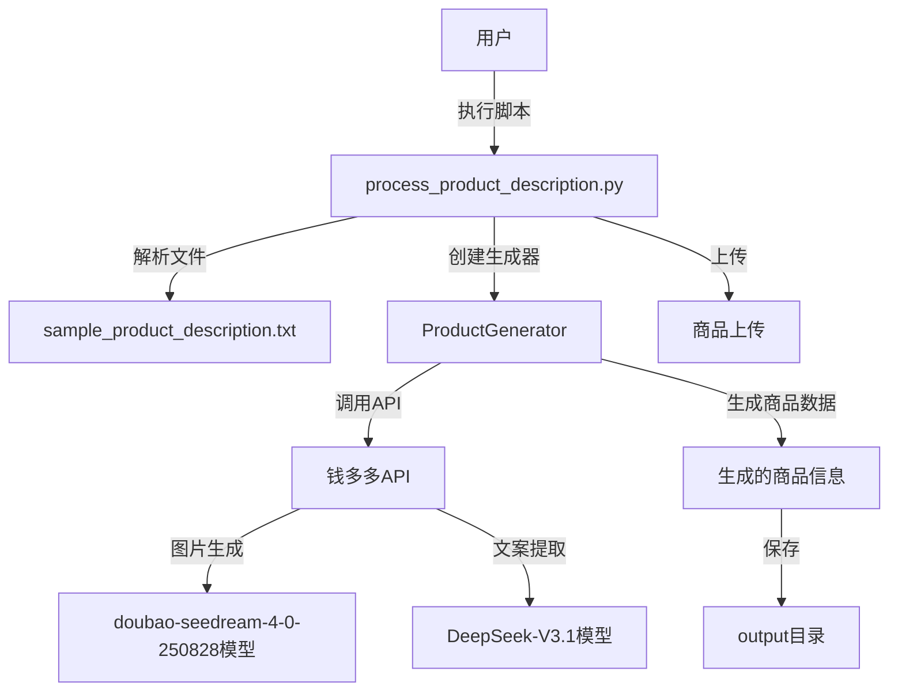
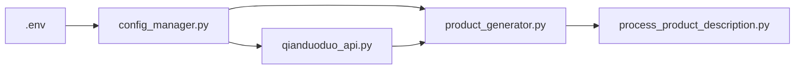

# 任务设计文档：使用钱多多API生成产品描述和图片

## 整体架构图

## 分层设计
1. **配置层**：.env文件存储API配置和模型选择
2. **API层**：src/api/qianduoduo_api.py封装API调用
3. **核心层**：src/core/product_generator.py实现产品生成逻辑
4. **流程层**：process_product_description.py协调整体流程

## 模块依赖关系

## 接口契约定义
1. **钱多多API接口**
   - 图片生成接口：
     - 输入：模型名称、提示词、参数
     - 输出：生成的图片URL或base64
   - 文案提取接口：
     - 输入：模型名称、原始文本、参数
     - 输出：提取的文案

2. **ProductGenerator类**
   - generate_product_images方法：
     - 输入：商品数据
     - 输出：图片列表
   - generate_product_description方法：
     - 输入：客户数据
     - 输出：商品描述

## 数据流向
1. 从sample_product_description.txt读取数据
2. 通过process_product_description.py解析并转换为客户数据
3. 客户数据传入ProductGenerator
4. ProductGenerator调用钱多多API生成图片和提取文案
5. 生成完整商品信息并保存到output目录

## 异常处理策略
1. API调用异常：使用@catch_exceptions装饰器捕获并记录
2. 配置缺失：提供默认值并记录警告
3. 文件操作异常：捕获并提供友好错误信息
4. 参数验证：在方法入口处验证参数有效性