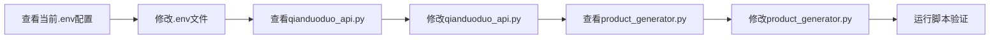

# 任务拆分文档：使用钱多多API生成产品描述和图片

## 任务依赖图

## 原子任务1：查看当前.env配置
- **输入契约**：
  - 无
- **输出契约**：
  - 当前.env文件内容
- **实现约束**：
  - 使用view_files工具
- **依赖关系**：
  - 前置：无
  - 后置：修改.env文件

## 原子任务2：修改.env文件
- **输入契约**：
  - 从原子任务1获取当前配置
- **输出契约**：
  - 更新后的.env文件，包含doubao-seedream-4-0-250828和DeepSeek-V3.1模型配置
- **实现约束**：
  - 使用update_file工具
- **依赖关系**：
  - 前置：查看当前.env配置
  - 后置：查看qianduoduo_api.py

## 原子任务3：查看qianduoduo_api.py
- **输入契约**：
  - 无
- **输出契约**：
  - 钱多多API实现代码
- **实现约束**：
  - 使用view_files工具
- **依赖关系**：
  - 前置：修改.env文件
  - 后置：修改qianduoduo_api.py

## 原子任务4：修改qianduoduo_api.py
- **输入契约**：
  - 从原子任务3获取的代码
- **输出契约**：
  - 更新后的API代码，支持指定模型
- **实现约束**：
  - 使用update_file工具
  - 仅修改src目录下的代码
- **依赖关系**：
  - 前置：查看qianduoduo_api.py
  - 后置：查看product_generator.py

## 原子任务5：查看product_generator.py
- **输入契约**：
  - 无
- **输出契约**：
  - 产品生成器代码
- **实现约束**：
  - 使用view_files工具
- **依赖关系**：
  - 前置：修改qianduoduo_api.py
  - 后置：修改product_generator.py

## 原子任务6：修改product_generator.py
- **输入契约**：
  - 从原子任务5获取的代码
- **输出契约**：
  - 更新后的生成器代码，与钱多多API正确集成
- **实现约束**：
  - 使用update_file工具
  - 仅修改src目录下的代码
- **依赖关系**：
  - 前置：查看product_generator.py
  - 后置：运行脚本验证

## 原子任务7：运行脚本验证
- **输入契约**：
  - 所有修改完成
- **输出契约**：
  - 验证结果
  - 生成的产品文件
- **实现约束**：
  - 使用run_command工具执行process_product_description.py
- **依赖关系**：
  - 前置：修改product_generator.py