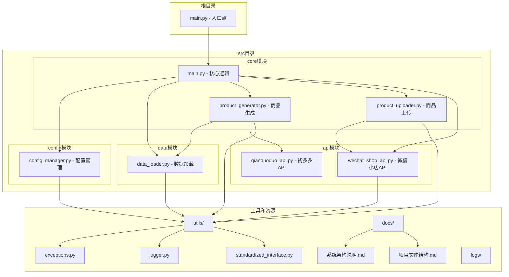

# 商品上传系统架构说明

## 系统概述
该系统是一个商品自动生成和上传到微信小店的工具，通过钱多多API获取商品信息，生成商品描述，然后上传到微信小店。

## 整体架构图

## 核心模块说明

### 1. 根目录入口模块 (main.py)
系统入口点，负责：
- 设置Python路径
- 导入并调用核心main函数
- 提供统一的启动方式

### 2. 核心主程序模块 (src/core/main.py)
核心逻辑协调器，负责：
- 解析命令行参数
- 初始化配置
- 加载客户数据
- 调用商品生成器
- 调用商品上传器
- 处理异常和日志

### 3. 配置管理模块 (src/config/config_manager.py)
负责：
- 加载和验证配置
- 管理API密钥和环境变量
- 提供统一的配置访问接口

### 4. 数据加载模块 (src/data/data_loader.py)
负责：
- 加载客户数据
- 验证数据格式
- 转换数据为内部格式

### 5. 商品生成模块 (src/core/product_generator.py)
负责：
- 通过钱多多API获取商品数据
- 生成商品描述和详情
- 准备商品上传数据

### 6. 商品上传模块 (src/core/product_uploader.py)
负责：
- 调用微信小店API上传商品
- 处理上传状态和进度
- 生成上传报告

### 7. API模块
- **微信小店API (src/api/wechat_shop_api.py)**：封装微信小店API调用
- **钱多多API (src/api/qianduoduo_api.py)**：封装钱多多API调用

## 工具模块

### 1. 异常处理模块 (utils/exceptions.py)
定义系统使用的异常类。

### 2. 日志模块 (utils/logger.py)
提供日志记录功能。

### 3. 标准化接口模块 (utils/standardized_interface.py)
提供标准化的数据和接口格式。

## 第三方API集成

### 1. 钱多多API (api/qianduoduo_api.py)
封装钱多多API调用，用于获取商品信息。

## 数据流程
1. 加载客户数据和配置
2. 通过钱多多API获取商品基础信息
3. 生成完整的商品描述和详情
4. 调用微信小店API上传商品
5. 生成上传报告和日志

## 异常处理策略
- 使用装饰器统一捕获和处理异常
- 针对不同类型的异常提供相应的处理逻辑
- 记录详细的错误日志
- 提供友好的错误提示