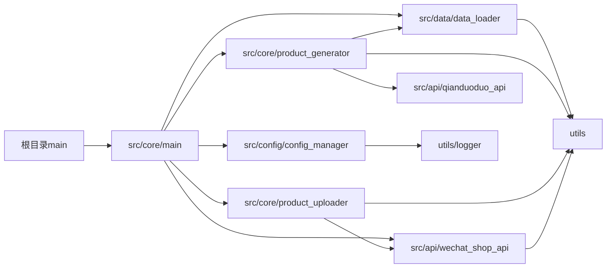

# 项目文件结构说明

## 当前项目文件组织结构

```
upload_product/
├── .env                     # 环境变量配置文件
├── .env.example             # 环境变量示例文件
├── README.md                # 项目说明文档
├── config.json.example      # 配置文件示例
├── requirements.txt         # Python依赖包列表
├── main.py                  # 程序入口点
├── docs/                    # 文档目录
│   ├── 系统架构说明.md      # 系统架构文档
│   ├── 项目文件结构.md      # 项目文件结构说明
│   └── 项目文件整理/        # 文件整理相关文档
├── logs/                    # 日志文件目录
├── src/                     # 源代码主目录
│   ├── config/              # 配置管理模块
│   │   └── config_manager.py
│   ├── data/                # 数据处理模块
│   │   └── data_loader.py
│   ├── core/                # 核心业务逻辑
│   │   ├── main.py
│   │   ├── product_generator.py
│   │   └── product_uploader.py
│   └── api/                 # API接口模块
│       ├── wechat_shop_api.py
│       └── qianduoduo_api.py
├── utils/                   # 工具模块
│   ├── exceptions.py        # 异常定义
│   ├── logger.py            # 日志工具
│   └── standardized_interface.py  # 标准化接口
└── bak/                     # 归档文件目录
```

## 各目录和文件的作用说明

### 根目录
- **main.py**：程序入口点，负责设置Python路径并调用核心main函数
- **.env**：存储敏感配置信息（API密钥、数据库密码等）
- **.env.example**：环境变量配置示例
- **config.json.example**：配置文件示例
- **requirements.txt**：项目依赖列表
- **README.md**：项目概述和使用说明

### src目录
源代码主目录，采用分层架构设计

#### src/config/
- **config_manager.py**：配置管理器，负责加载、验证和提供配置访问接口

#### src/data/
- **data_loader.py**：数据加载器，负责加载客户数据并进行验证和转换

#### src/core/
- **main.py**：核心主程序，协调整个流程的执行
- **product_generator.py**：商品生成器，负责生成商品信息
- **product_uploader.py**：商品上传器，负责上传商品到微信小店

#### src/api/
- **wechat_shop_api.py**：微信小店API封装
- **qianduoduo_api.py**：钱多多API封装

### utils/目录
工具模块，提供通用功能
- **exceptions.py**：自定义异常类定义
- **logger.py**：日志记录工具
- **standardized_interface.py**：标准化数据接口和验证工具

### docs/目录
文档目录
- **系统架构说明.md**：详细的系统架构文档
- **项目文件结构.md**：当前文件结构说明
- **项目文件整理/**：文件整理过程相关文档

### logs/目录
日志文件存储目录

### bak/目录
归档目录，存放非核心代码和历史文件

## 模块依赖关系



## 代码规范

1. **模块命名**：使用小写字母和下划线
2. **类命名**：使用驼峰命名法
3. **函数命名**：使用小写字母和下划线
4. **导入顺序**：标准库 -> 第三方库 -> 项目内部模块
5. **路径引用**：使用相对导入，从src目录开始

## 修改记录

**2025-10-30**：重构项目结构，将代码按功能模块分类到src目录下的config、data、core和api子目录中，使项目结构更清晰、更易于维护。